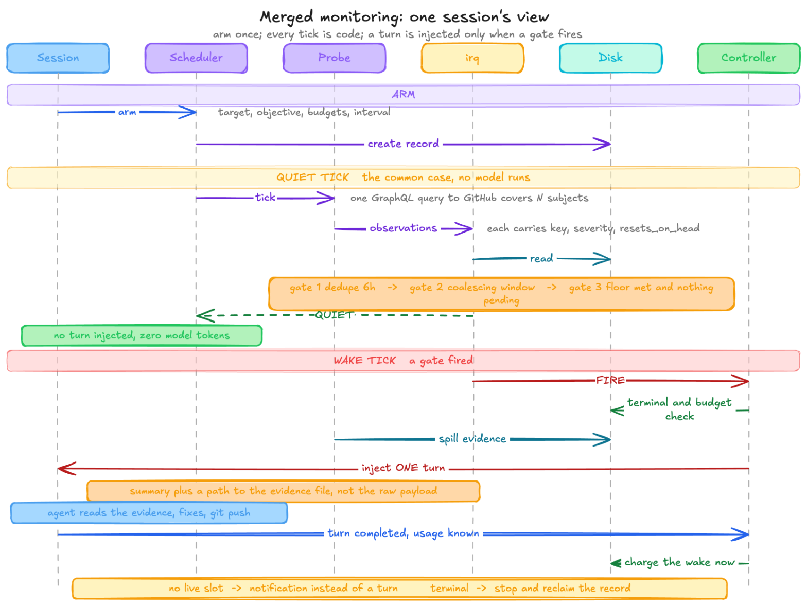

# RFC: one observation layer, one controller

Related: [rfc-token-efficient-monitors.md](rfc-token-efficient-monitors.md) specifies the structured-monitor half of what this document consolidates.

## Why

Three streams currently work on the same problem, which is keeping an agent turn from being spent on an external subject that has not usefully changed.

| Stream | Where it lives | Pull requests |
|---|---|---|
| structured monitors | `src/kiro_crew/monitoring/` | merged: [#5180](https://github.com/kirodotdev/KiroCrew/pull/5180), [#5181](https://github.com/kirodotdev/KiroCrew/pull/5181), [#5182](https://github.com/kirodotdev/KiroCrew/pull/5182), [#5183](https://github.com/kirodotdev/KiroCrew/pull/5183), [#5184](https://github.com/kirodotdev/KiroCrew/pull/5184). open: [#5185](https://github.com/kirodotdev/KiroCrew/pull/5185), [#5186](https://github.com/kirodotdev/KiroCrew/pull/5186), [#5305](https://github.com/kirodotdev/KiroCrew/pull/5305) |
| irq kernel and pr_watch cron | `irq.py`, `probes/gh_pr.py`, `babysit/scripts/pr_watch.py` | merged: [#5273](https://github.com/kirodotdev/KiroCrew/pull/5273), [#5886](https://github.com/kirodotdev/KiroCrew/pull/5886), [#6071](https://github.com/kirodotdev/KiroCrew/pull/6071), [#6279](https://github.com/kirodotdev/KiroCrew/pull/6279), [#7431](https://github.com/kirodotdev/KiroCrew/pull/7431), [#7634](https://github.com/kirodotdev/KiroCrew/pull/7634), [#8122](https://github.com/kirodotdev/KiroCrew/pull/8122), [#8326](https://github.com/kirodotdev/KiroCrew/pull/8326) |
| self-armed loops for member slots | `autonudge_selfarm.py` (new), `autonudge.py`, `autonudge_authz.py`, `mcp_tools/control.py` | open: [#8919](https://github.com/kirodotdev/KiroCrew/pull/8919) |

This document states the target shape, what gets deleted, and the order.

Two facts set the ceiling on what consolidation is worth. Skill bodies are the largest single block of assembled context, and this is measured rather than asserted: aggregating the `ctx_blocks` field that `_build_token_record` in `dashboard/handlers/usage.py` writes into every turn record gives, over 50 days and 22,877 turns, `loaded_skill` at 27.58 percent of all assembled context and `skill_index` at a further 6.74 percent, against 9.35 percent for the user's own message. The comment on the triggered-skills branch of `context.build_message` says the same thing in the code. The unit is characters, not tokens, deliberately: `context_blocks.py` does not tokenize because only an OpenAI BPE is available and applying it against a Claude backend would add systematic error.

The second fact is that a body is not re-sent per turn so much as permanent. ACP replays native history, so a body that enters the window once is replayed for the rest of the session. The saving therefore comes from never admitting the body, not from suppressing a repeat. A `minimal_context` turn skips skill injection entirely (the `minimal_context` guard on the triggered-skills branch of `context.build_message`), which is what a zero-token cron wake already does.

## What #9073 already settled

[#9073](https://github.com/kirodotdev/KiroCrew/pull/9073), merged 2026-09-07, moved the session-directive selector off the tool result text and onto the call's input. This changes the starting point for this work, so it is stated first.

| | Before [#9073](https://github.com/kirodotdev/KiroCrew/pull/9073) | Now |
|---|---|---|
| What names the directive | a marker inside the tool's result text, repaired across backend reshaping | `sha256(tool + canonical_json(args))`, computed by the gateway in `session_directive.call_input_digest` |
| Where it waits | recovered from the result body | a turn-scoped bounded queue, `dashboard/directive_queue.py`, 300s age, 8 per session, 256 sessions |
| Who claims it | `_repair_escaped_marker` then apply | `directive_queue.claim(session_key, input_digest, not_before=turn_start)` |
| `_repair_escaped_marker` | load-bearing | deleted, zero hits in `src/` |

The consequence for this RFC is narrowing, and welcome: `monitor_start` and `monitor_watch` now share the transport completely, one `_emit_directive`, one queue, one digest, one claim, one `apply_session_directive` dispatch. What remains unshared is exactly the observation layer and the wake decision. That is the whole remaining scope.

Two asymmetries survive and the merged design has to pick one. `monitor_watch` uses the full strict session gate and refuses on a non-strict key through `require_strict_session_key`, while `monitor_start` uses the resolve half only and lets an empty key fall through to the directive. And [#9073](https://github.com/kirodotdev/KiroCrew/pull/9073) verifiably did not touch the `gate` parameter or the `irq.poll` path from [#7634](https://github.com/kirodotdev/KiroCrew/pull/7634): its only file under `autonudge*`, `irq` or `probes` is a test.

## Target shape

One stack, split by layer.

The sequence below is the whole runtime, from one session's point of view: arm once, then every tick is code, and a turn is injected only when a gate fires.



Six lifelines, three phases. ARM records the watch, and no model runs from that point on. On a QUIET TICK the probe answers from one batched query, irq applies dedupe, the coalescing window and the floor, and the verdict is QUIET, so no turn is injected. On a WAKE TICK irq fires the coalesced observations, the controller checks terminal state and budget, the evidence is spilled to a file, and exactly one turn is injected carrying a summary and that path. The wake is charged after the turn completes and its usage is known. Two exits: no live slot degrades to a notification, and a terminal observation stops the watch and reclaims the record.

The layers that sequence runs through:

| Layer | Component after the merge | Responsibility |
|---|---|---|
| transport | already shared, from [#9073](https://github.com/kirodotdev/KiroCrew/pull/9073) | claim a directive by call-input digest and apply it |
| observation | irq | watch, wait, collect, act. Produce named observations, hold the coalescing window, reset on epoch change, dedupe with a time bound, centralise the failure rules |
| decision | structured controller | terminal outcomes, budgets over runtime, turns, tokens and provider errors, charge the wake after the turn completes |
| dispatch | structured controller | route the wake to the bound session, or to a notification when there is no live slot |
| arming | shared, plus [#8919](https://github.com/kirodotdev/KiroCrew/pull/8919)'s self-arm | who may arm a loop, and for which slot |

The seam that makes this work already exists: the structured decision layer consumes a normalised `MonitorObservation` rather than raw provider output, so irq becomes the layer that produces observations.

## The change that unlocks it

A structured monitor reduces one PR to a single fingerprint over every fact it reads. irq produces a list of named entries, each carrying a severity and whether it resets on a new head. **A single fingerprint is the one-entry case of that list.** So the provider emitting a list instead of a hash changes no behaviour, and the five actionable buckets it already computes are already five names. `MONITOR_STATE_VERSION` and `_raw_payload` give the state migration a path that is already in the code.

## What gets deleted

Duplication here means the same decision or the same state implemented twice, not two files that happen to be near each other.

| Deleted | Why it is redundant, not merely similar |
|---|---|
| the single-fingerprint computation in `monitoring/github_pull_request.py` | replaced by a derivation from the named entries, so there is one source of truth rather than two hashes that can drift |
| irq's own delivered-cycle counting and quiet-streak floor | the structured budgets subsume them, and they were only ever a stand-in for accounting irq does not have |
| the `gate` parameter's separate path on `monitor_start` ([#7634](https://github.com/kirodotdev/KiroCrew/pull/7634)) | once the observation layer is shared, a second gate on one of the two tools has nothing left to do |
| `builtin_skills/kirocrew-dev/babysit/scripts/gh_merge_watch.py` (local, unversioned) | `pr_watch.py` already raises `Done` on merge and adds a state file, per-head dedupe and an error backstop that `gh_merge_watch` lacks |

[#8919](https://github.com/kirodotdev/KiroCrew/pull/8919) is not duplicate. It extends the same stack rather than reimplementing it: it adds a `self_armed` bit and a keystone-gated trust record so a member slot can arm its own loop, reusing `NudgeLoop`, `add_monitor()` and the `authorize_and_add_nudge` chokepoint. It is integrated, not deleted. Separately, [#3127](https://github.com/kirodotdev/KiroCrew/pull/3127) was a pure structural move of the monitor tool descriptors from `mcp_core.py` into `mcp_tools/control.py`; it changes where this work edits, not what it merges.

## Order

| Step | Change | Behaviour change | Depends on |
|---|---|---|---|
| 1 | the provider emits named observations; the existing fingerprint is derived from them | none, proven by a golden test over every existing fixture | nothing |
| 2 | the coalescing window becomes a pre-stage ahead of the decision, default off, on for babysit | none while off | 1 |
| 3 | structured budgets and completed-turn accounting replace irq's delivered-cycle count | irq gains budgets it does not have | 1 |
| 4 | both drivers run the same probe: the in-process scheduler and the cron subprocess | none, [#7634](https://github.com/kirodotdev/KiroCrew/pull/7634) already ran one probe from two drivers | 1, 2 |
| 5 | the probe contract is exposed as an SDK: implement `identity()` and `observe()`, inherit scheduling, dedupe, coalescing, epoch reset and failure handling | new capability | 1 to 4 |
| 6 | integrate [#8919](https://github.com/kirodotdev/KiroCrew/pull/8919)'s self-arm so a member slot can arm a merged monitor | new capability | 1, and [#8919](https://github.com/kirodotdev/KiroCrew/pull/8919) landing |
| 7 | one poller batches many subjects in a single GraphQL query, and the dashboard surface moves in the SAME step | new capability, and watches stop being slot-scoped | 4 |
| 8 | rate-limit classification and an error budget adopted from the structured side; orphaned watches reclaimed through the terminal-outcome path | closes two gaps that exist today | 3 |

Step 1 lands first because it changes no behaviour, which makes it the cheapest thing to review, and every later step shrinks once it is in.

Step 0, independent of all of the above and the only item with an external deadline: teach the goal popover to see a structured monitor, before [#5186](https://github.com/kirodotdev/KiroCrew/pull/5186) lands. The API half is done -- both legacy read routes now report that a monitor is armed, its cadence and its state, while the owner-gated route keeps sole custody of what is being watched. They do NOT report how far in it is -- see below -- so what is left of step 0 is that gap plus the popover rendering the shape it does receive.

Two remainders of step 0 are DEFERRED rather than closed, and both are named here so neither reads as an oversight:

- **The websocket does not push a structured change to a non-owner.** The REST reads now entitle a non-owner to a reduced monitor row, but the `autonudge_state` frame for a structured loop still goes through `broadcast_ws_owners` (`slack/gateway.py`), so that reader gets no invalidation and its view stays as fetched until it reconnects. Closing this means a reduced presence frame riding `broadcast_ws`, in the same file the step-0 API change deliberately did not touch. An owner is unaffected: it receives the frame and re-reads.
- **The frame and the REST read now disagree about the same record.** The frame still carries `message`, `max_cycles` and `cycle_count` for a structured monitor. `message` is not a boundary crossing there, since the frame is owner-only, but the two counters are as misleading on the socket as they were on the read.

## Failure modes the merged design must carry

From irq, which the structured controller does not have today:

- re-alert bounded in time, because a script that exits after emitting can never observe whether delivery succeeded, so a permanent dedupe mark turns one lost delivery into permanent silence
- a future timestamp read as stale, so a hand-edited file or a clock jump cannot silence a watch forever
- malformed state degraded to a fresh read rather than a raising tick, because a cron that raises every tick is auto-paused and the watch dies quietly
- a failed state write delivered immediately with a warning, because an un-aged window turns a wake into a loss
- a consecutive-error backstop that reports the watch as blind

From [#9073](https://github.com/kirodotdev/KiroCrew/pull/9073), which every arming caller must now handle:

- 403 `not_local_caller`, 400 `session_key_required`, `not_derivable`, `invalid_directive`
- a claim miss at the consumer: input differs, parked before this turn, or a sibling frame already matched
- a refusal rather than a guess when a native sub-agent calls a session-bound tool, and when a sub-agent call in the same turn shares the parent's digest
- queue overflow, which drops the oldest record past 8 per session

## Dashboard surface

The dashboard's goal popover is part of this design, not a follow-up. It is the only place a person can see what is armed, and the merge breaks two of its premises.

**It could not see a structured monitor at all, and now it can.** The popover reads `GET /api/autonudge/slot/{slot_key}`, which used to null a structured monitor out on purpose:

```
loop = svc.get_by_slot(slot_key)
legacy = loop if loop is not None and not is_structured_monitor_loop(loop) else None
```

The structured read lives on a different endpoint, `/api/session-monitor`, which requires an authenticated session binding and is the agent-facing path behind `monitor_inspect`. So the moment [#5186](https://github.com/kirodotdev/KiroCrew/pull/5186) routed babysit through `monitor_watch`, the popover would have reported no loop while a monitor was running. Step 0 closed that, and closed it by ENTITLEMENT rather than by returning the record: the legacy reads have no owner gate, so they now publish existence, cadence and state -- the loop's own entitled fields -- and withhold everything that describes what is being watched. `message` is withheld too, because on a structured monitor it IS the wake instructions. `/api/monitors`, behind `_require_monitor_owner`, stays the only place the full record appears. Two things remain open. The payload does NOT answer "how far in", because the cycle accounting it would have used is withheld as false and the `monitor_presence` object prepared for it was held back to ship with its reader rather than ahead of it. And the popover still has to render what does arrive.

**Its armed-watch list is slot-scoped.** Watches are filtered with `runBelongsToSlot(session_key, slotKey)` against the `dashboard:<slotKey>` convention, and only script crons count. A watch that moves out of session has no slot in its identity, so batching many subjects into one poller makes every one of them invisible here.

Three inputs also drift in meaning once the loop is probe-gated:

| Input | What the dialog says | What it now means |
|---|---|---|
| Seconds between nudges | sends a nudge at this interval | observes at this interval and nudges only when the observation is worth a turn, and it is an idle gap rather than a period, so real cadence is the interval plus the previous turn's duration |
| Max cycles, 0 = unlimited | cycles of the loop | DELIVERED turns, counting the streak-floor delivery, a gate fallback and a post-wake follow-up, not intervals and not wakes. [#5186](https://github.com/kirodotdev/KiroCrew/pull/5186) also sets 24 cycles and 4 hours for the legacy MCP path and rejects an explicit unlimited, so the dialog offering 0 is already inconsistent with it |
| Goal description | free text | a structured monitor needs a typed `target` and `objective` instead, so the surface has to carry both shapes |

What the surface has to answer changes from "what is armed on this tab" to three questions: what this gateway is watching, which of those will wake a session rather than only notify, and what it has spent. The spend half has real data to show for the first time once budgets move in.

This builds on [#8936](https://github.com/kirodotdev/KiroCrew/pull/8936), which already moves the same four files (`autoNudgeLoop.ts`, `AutoNudgePopover.tsx`, `useWebSocket.ts`, `api/client.ts`) toward a per-member patrol view. That is the same one-to-many direction, so the redesign extends it rather than replacing it.

Sequencing constraint: the surface ships in the same step as batching, never later. A step that makes watches invisible while they run is not acceptable even briefly.

## Three gaps neither side closes today

**Rate limiting is unclassified on the irq side.** Searching `github_runner.py`, `probes/gh_pr.py` and `irq.py` for a rate-limit, 403, 429 or `Retry-After` path returns nothing: a throttled call is indistinguishable from a missing repo, both landing in `fetch_ok=False` and eventually the blind backstop. The structured provider does classify it, as `ProviderErrorKind.RATE_LIMITED`, treats it as retryable, and bounds it with `max_provider_errors`. Since every watch spends the same shared credential, one unclassified runaway degrades every other session's GitHub calls. The classification and the error budget come from the structured side.

**Nothing reclaims an orphaned watch.** There is no orphan or stale-job path in the irq code. A cron watch outlives the session that armed it by design, which is the point, but it also outlives any reason to exist: absent a merge that raises `Done`, it runs until it is removed by hand. Reclamation needs somewhere to live, and the natural place is the terminal-outcome machinery the structured side already has.

**Batching is only reachable from a single out-of-session poller.** `gh pr view` takes one pull request per call, but `gh api graphql` takes many in one query, and the repository already does this in `issue_radar/backend/github_queries.py`, `prepare-pr/scripts/pr_status.py`, `pr_findings.py` and the structured provider's own review-thread read. Fifty pull requests are one GraphQL query for one poller, against roughly one hundred and fifty `gh` calls for fifty session-bound monitors. `pr_watch` does not use GraphQL today.

That last point is the strongest argument for keeping an out-of-session driver, and it is stronger than lifecycle independence: a session-bound monitor structurally cannot batch, because each loop knows only its own subject. It also mitigates the first point by reducing call volume by two orders of magnitude.

## Prior art

The shape both stacks converged on is Prometheus Alertmanager's notification pipeline with a model in the position of the paged human. The mapping is close enough to be worth stating, because it says which knobs are missing rather than merely that the design is reasonable.

| Alertmanager | Here |
|---|---|
| `group_by`, a label set | the observation `key` |
| `group_wait`, buffer before a group's first notification, typically seconds to a few minutes | the coalescing floor, 240s |
| `group_interval`, wait before notifying about a new member added to an already-notified group | **absent**. [#7431](https://github.com/kirodotdev/KiroCrew/pull/7431) gives a joining entry its own full floor instead, which is a defensible choice but not the same knob |
| `repeat_interval`, re-send an alert already delivered | the time-bounded re-alert, 6h |
| `inhibit_rules` and silences | `known_reds` |
| `send_resolved` | the `ready` and terminal observations |
| dedupe, group, route, silence | the kernel |

The axis the two stacks actually differ on has a name too. A fingerprint that fires on change is edge-triggered; a per-key record that re-asserts on a clock is level-triggered. Industry leans level-triggered wherever a missed event is unacceptable: Kubernetes controllers reconcile level-triggered by design, `epoll`'s edge-triggered mode is documented as requiring the caller to drain or lose readiness, and Alertmanager is itself level-triggered because Prometheus re-sends a firing state every evaluation and lets the receiver dedupe. The observation layer should therefore stay level-triggered and per-key.

Alertmanager needs no token budget because a paged human self-limits. An agent does not, which is exactly the half the structured controller contributes.

**One gap both designs share.** Across the surveyed products that offer a deferred or periodic agent primitive, the near-universal pattern is a fresh session per wake rather than appending to one conversation, and Temporal names the timer-loop-in-one-history shape an anti-pattern for exactly that reason. Both stacks here re-inject into the same session, so history grows with every cycle; the `prepare-pr` guidance to keep per-cycle output small because a chatty loop burns its own context is a symptom of it. Gating decides whether to wake. It does nothing about waking into forty cycles of replayed history, and against measured composition that is where the remaining cost sits. It belongs in its own RFC, and it is worth more than this merge.

## Not in scope

The skill-prose reduction is a separate track. It shares a motivation with this one and none of its code, and the honest claim there is that a body should never enter the window rather than that a repeat is being suppressed.

Retiring the remaining marker consumers is [#9073](https://github.com/kirodotdev/KiroCrew/pull/9073)'s own follow-up, not this RFC's: `mcp_apps_render.find_marker` still reads a result body, and the messaging `TurnDriver` still applies directives from the marker on kiro-cli.

## Open decisions

Whether the out-of-session cron driver stays a supported channel or retires with the legacy babysit recipe. It is the only path that survives the session it was armed from, and everything the session-bound path can watch it can also watch.

Whether [#5186](https://github.com/kirodotdev/KiroCrew/pull/5186) scopes legacy to the targets it does not support rather than demoting `monitor_start` wholesale. `goal-conductor` and `pipeline-conductor` patrol their own session with it as their primary use, neither sets `max_cycles` or `max_runtime_secs`, and under the legacy defaults of 24 cycles and 4 hours a long-horizon patrol stops silently.

Which session gate the merged arming path takes: `monitor_watch`'s strict refusal or `monitor_start`'s resolve-half fall-through.

`docs/system-specs/modules/babysit-pr-watch.md` states there are two current monitoring modes. [#5186](https://github.com/kirodotdev/KiroCrew/pull/5186) does not touch it, so it becomes false when [#5186](https://github.com/kirodotdev/KiroCrew/pull/5186) lands.
