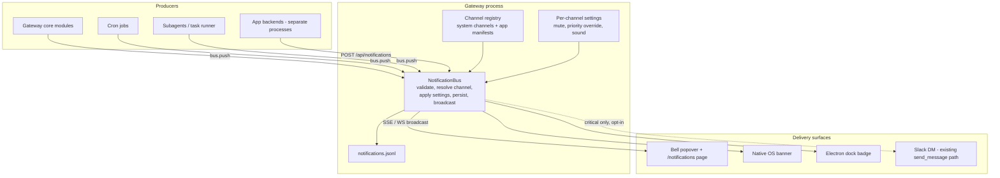
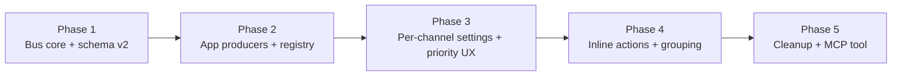

# RFC: Local Notification Bus

> **Current behaviour: see `docs/system-specs/modules/app-notifications.md`.**
> That spec owns the shipped bus — `NotificationBus.push`, the
> token/rate-limit/lifecycle-lock ordering, lazy channel registration,
> `RESERVED_APP_NAMES` and the `system.agent` agent-push path. Read the phase
> plan below only for Phase 2's missing producer and Phase 5's third item.

- Status: partial — Phases 1, 3 and 4 are fully on main (bus core + schema v2, per-channel settings + priority UX, inline actions + `group_key` stacking + dock badge). Phase 2's mechanism is complete and wired (`POST /api/notifications/push`, manifest `notifications.channels`, rate limiter) but has **no producer**: zero shipped `app.json` declares a channel, so its exit criterion is unproven end-to-end. Phase 5 shipped 2 of 3 (the `send_notification` MCP tool and the TTL sweeper); removing the kind-based routing fallbacks is unstarted — `NotificationDetailPanel.tsx` still branches on `n.kind`. Slack escalation was **withdrawn**, not shipped, and is superseded by `rfc-notification-bridge.md`.
- Author: KiroCrew contributors
- Created: 2026-07-10
- Related: rfc-federated-app-platform.md (apps as notification producers), rfc-event-loop-fault-isolation.md (gateway process boundaries)

## Summary

Evolve KiroCrew's notification system from a hardcoded internal function into a local notification bus modeled on the mobile OS notification pattern (APNs/FCM channels, priorities, inline actions), with the gateway process acting as the on-device push service. Any producer -- gateway internals, cron jobs, subagents, and installed apps -- can publish structured notifications through one entry point, and users control delivery per channel. No cloud infrastructure is involved; all transport is local IPC (HTTP to the gateway, SSE/WebSocket to the dashboard).

## Motivation

### Current state

Notifications are generated by `DashboardState.notify(kind, title, body, *, meta=None)` (`src/kiro_crew/dashboard/state.py:1508`). The method appends to an in-memory log, increments an unread counter, broadcasts to SSE/WS clients, and persists to `~/.kirocrew/notifications.jsonl`.

Producers are hardcoded call sites inside the gateway:

| Call site | Kind |
|-----------|------|
| `dashboard/handlers/messaging.py` (`send_message` fallback) | `agent` |
| `dashboard/handlers/hooks.py` (webhook completion) | `hook` |
| `slack/gateway.py` (cron completion) | `cron` |
| `slack/gateway.py` (heartbeat result) | `heartbeat` |
| `slack/gateway.py` (task runner result) | `taskrunner` |

The frontend renders these through a bell popover and a `/notifications` page (`NotificationFeed`, `NotificationDetailPanel`), with date grouping, per-kind filtering, read/unread state, native browser notifications, and a sound system.

### Problems

1. **Apps cannot notify.** The app platform (rfc-federated-app-platform.md) positions apps as the domain-specific experience layer, yet an app backend has no way to surface "a new Sev-2 ticket arrived" in the notification center. Oncall-radar works around this today by routing through cron `send_message`, which mislabels the source and loses app identity.
2. **No urgency model.** An approval request that blocks an agent turn and a passive heartbeat completion carry identical weight. The bell badge, sound, and native banner fire the same way for both.
3. **All-or-nothing settings.** The only user control is a global sound toggle. Muting heartbeat noise while keeping approval alerts loud is impossible.
4. **No inline actions.** Acting on an approval requires opening the popover, selecting the notification, reading the detail panel, then clicking. Four interactions for a one-bit decision.
5. **Hardcoded routing.** `NotificationDetailPanel` switches on `kind` to decide navigation targets. Every new notification source requires frontend changes.

### Why the mobile OS model

iOS and Android solved the same shape of problem: many independent producers, one aggregation surface, scarce user attention. The relevant abstractions -- channels declared by producers, per-channel user settings, priority tiers, group stacking, inline actions -- transfer directly. The abstractions that do NOT transfer (cloud push relay, lock-screen delivery, device tokens) are exactly the parts this RFC excludes: the gateway is always local and always running, so it plays the role APNs/FCM plays remotely.

## Goals

- Any producer (gateway module, cron, subagent, app backend) publishes through one API.
- Apps declare notification channels in their manifest; unknown channels are rejected.
- Users mute, re-prioritize, and set sounds per channel.
- Three priority tiers drive visual weight, sound, badge counting, and native banner behavior.
- Notifications carry optional inline actions and a generic deep-link URL.
- Full backward compatibility: existing `notify()` call sites and the existing `notifications.jsonl` history keep working at every phase.

## Non-goals

- Cloud push (APNs/FCM relay, remote delivery to phones). Slack remains the away-from-desk channel.
- Notification scheduling or digests (possible later phase, out of scope here).
- Rich media bodies (images, embedded widgets).
- Cross-instance notification sync between multiple gateways.

## Design

### Target architecture



### Notification payload (v2 schema)

```python
@dataclass
class NotificationPayload:
    source: str                     # "system" | "app:<app-name>"
    channel: str                    # "system.cron" | "<app-name>.<channel-id>"
    title: str
    body: str                       # markdown
    priority: str = "default"       # "critical" | "default" | "passive"
    group_key: str | None = None    # stack related notifications
    actions: list[dict] | None = None  # [{"id", "label", "style"}]
    url: str | None = None          # deep-link on click (dashboard route)
    icon: str | None = None         # lucide icon name
    ttl: int | None = None          # seconds until auto-expire (passive cleanup)
    meta: dict | None = None        # producer-specific k/v
```

Persisted JSONL rows gain the new fields. Rows written by the old schema (`kind` instead of `source`/`channel`) are normalized at load time: `kind=X` maps to `source="system", channel="system.X"`. No file migration is required.

### Channel registry

Two channel classes:

1. **System channels**, auto-registered at startup: `system.cron`, `system.heartbeat`, `system.hook`, `system.agent`, `system.approval`, `system.subagent`, `system.taskrunner`. These mirror the existing kinds one-to-one. Default priorities: `system.approval` is `critical` (it blocks an agent turn); `system.subagent` is `passive` (the completion event already injects into the originating chat session and appears in the Activity sidebar, so the notification is a secondary history record -- users running long detached subagents can promote the channel in settings); all others are `default`.
2. **App channels**, declared in `app.json`:

```json
{
  "notifications": {
    "channels": [
      {
        "id": "ticket-update",
        "name": "Ticket Updates",
        "icon": "ticket",
        "default_priority": "default"
      }
    ]
  }
}
```

Channels are registered at app install/enable and removed at uninstall. A push referencing an unregistered channel is rejected with 400. This is the same contract Android enforces: a producer cannot notify outside its declared channels, which gives users a stable settings surface.

Apps are capped at 8 declared channels, enforced at manifest validation. Android's uncapped channels produced settings-screen sprawl; enforcing the cap at install time is one check now, while lowering a cap after apps ship with more is a breaking change. The most channel-hungry reference app (oncall-radar) needs 3. The cap can be raised later without breaking anything.

### Priority semantics

| Tier | Bell badge | Sound | Native banner | Visual |
|------|-----------|-------|---------------|--------|
| critical | counted | always (unless channel muted) | always | accent border, top of feed |
| default | counted | per channel setting | per channel setting | standard |
| passive | not counted | never | never | dimmed; auto-expires if `ttl` set |

Per-channel user settings can override the producer's declared priority downward (critical to default, default to passive) but never upward -- a producer cannot be promoted to interrupt by another producer, only by the user.

### Producer APIs

1. **In-process (Python):** `bus.push(payload)` -- used by gateway modules, cron runner, heartbeat, task runner.
2. **HTTP:** `POST /api/notifications` -- authenticated with the existing app-backend token mechanism; used by app backends running as separate processes. The handler resolves `source` from the authenticated app identity rather than trusting the body, so an app cannot impersonate another source.
3. **MCP tool (later phase):** `send_notification` for agents, wrapping the same bus.

### Delivery pipeline

`bus.push` runs, in order:

1. Schema validation (dataclass field checks, priority enum, action shape).
2. Channel resolution against the registry; reject unknown.
3. Settings application: muted channel drops sound/banner and marks passive; priority override applied.
4. Persist to JSONL (existing `_persist_notification` path, extended fields).
5. Broadcast over SSE/WS (existing `_broadcast` path, unchanged wire event name).
6. Surface side effects by effective priority: unread counter, native Notification API trigger, Electron dock badge update.

### Rate limiting (app producers)

Token bucket per app: 30 notifications per 5 minutes, burst 10. Exceeding the budget returns 429 and logs a SEL event. System channels are exempt. This is deliberately coarse; the goal is stopping a buggy loop from flooding the center rather than fine-grained fairness.

### Frontend changes

- `NotificationFeed` gains a group-by-source mode (sections per app/system) alongside the existing date grouping; kind filter chips become channel filter chips fed by the registry.
- `NotificationItem` renders `actions[]` as inline buttons; clicking posts to the existing action endpoints (approval approve/reject first).
- `NotificationDetailPanel` uses the payload `url` for navigation when present, falling back to the current kind-based routing for legacy rows.
- Settings gains a Notifications section listing registered channels grouped by source, each with mute toggle, priority override, and sound picker. New app channels default to their declared `default_priority`; the first notification from a newly installed app renders an inline keep/mute prompt (the iOS provisional delivery pattern).
- Priority drives feed row treatment: critical rows get the accent left border and sort to the top of their date group; passive rows render dimmed and are excluded from the badge count.

## Migration plan

Each phase ships independently and leaves the system fully working.



### Phase 1: Bus core and schema v2 (backend only, invisible)

- New module `src/kiro_crew/notifications/bus.py` with `NotificationPayload` and `NotificationBus.push`.
- `DashboardState.notify()` becomes a thin adapter that builds a v2 payload (`source="system"`, `channel="system.{kind}"`) and calls `bus.push`. All five call sites keep their signatures.
- JSONL load path normalizes legacy rows; write path emits v2 fields.
- System channels auto-registered.
- Exit criteria: all existing notification tests pass unchanged; new bus unit tests cover validation, normalization, and the adapter.

### Phase 2: App producers

- `POST /api/notifications` handler with app-token auth and source resolution.
- `app.json` manifest parser extension for `notifications.channels`; registry updates on install/enable/disable/uninstall; channel cap (8 per app) enforced at manifest validation.
- Rate limiting with SEL logging.
- Migrate oncall-radar (the reference app) from the `send_message` workaround to declared channels, proving the end-to-end path.
- Exit criteria: oncall-radar ticket notifications appear with correct app source and icon; unknown-channel and rate-limit rejections covered by handler tests.

### Phase 3: Per-channel settings and priority UX

- Settings storage under `notifications.channel_settings.<channel>` in config.
- Settings UI section (channel list grouped by source).
- Priority tiers wired through badge counting, sound triggering, native banner, and feed styling.
- Provisional keep/mute prompt for first notification from a new app channel.
- Exit criteria: muting `system.heartbeat` silences it everywhere while `system.approval` still interrupts; badge count excludes passive rows.

### Phase 4: Inline actions and grouping

- `actions[]` rendering in feed rows and popover; approval approve/reject wired first.
- `group_key` stacking in the feed (collapsed stack with count, expand on click).
- Generic `url` deep-linking in the detail panel.
- Electron dock badge via `app.setBadgeCount` fed from the unread (critical+default) count.
- Exit criteria: an approval can be resolved from the bell popover in one click; repeated notifications with the same `group_key` collapse.

### Phase 5: Cleanup and agent tool

- Remove kind-based routing fallbacks once telemetry shows no legacy rows in the active window.
- `send_notification` MCP tool for agent sessions.
- TTL sweeper for expired passive notifications.
- Slack escalation for critical notifications: when a critical notification arrives and no dashboard client is connected (zero active SSE/WS sessions), forward it as a Slack DM through the existing `send_message` path. Opt-in per channel, default off, so Slack never double-fires while the dashboard is open and never becomes a duplicate feed. Delivered last because disconnect detection (laptop lid closed vs tab backgrounded vs network blip) needs usage data from the earlier phases to tune.

## Backward compatibility

| Surface | Guarantee |
|---------|-----------|
| `state.notify()` callers | Signature unchanged; adapter forwards to bus indefinitely |
| `notifications.jsonl` history | Legacy rows normalized at load; never rewritten in place |
| SSE/WS wire format | Event name unchanged; payload gains optional fields only |
| Frontend Redux slice | `kind` remains derivable (`channel.split(".").pop()`) for existing selectors during transition |
| Workspace export/import | Portability includes the same file; new fields round-trip |

## Security considerations

- App pushes authenticate with the existing app-backend token; `source` is derived server-side from the token identity, never from the request body.
- Rate limiting bounds a compromised or buggy app's ability to flood the center; violations are SEL-logged.
- Action buttons only dispatch to existing authenticated dashboard endpoints; the payload carries action identifiers, never executable content.
- `url` deep-links are restricted to dashboard-internal routes (path-only, no external schemes).

## Alternatives considered

1. **Keep `send_message` as the app path.** Rejected: it conflates chat delivery with notification delivery, loses app identity, and gives users no per-source control.
2. **OS-native notification channels only (skip the in-app center rework).** Rejected: browser/Electron Notification API has no channel or settings model, and the dashboard center is the primary surface users actually triage from.
3. **Full event bus (generic pub/sub for all gateway events).** Rejected as scope creep; notifications are one consumer pattern, and generalizing now would delay the app-producer gap fix without a concrete second consumer.

## Resolved design questions

1. **Slack escalation for critical notifications — SUPERSEDED by rfc-notification-bridge.md.** The Phase 5 opt-in escalation (critical + no dashboard client connected → owner Slack DM) was built in PR #422 and withdrawn before merge: hardcoding one transport in a five-transport product creates a settings contract needing immediate migration, and point-in-time disconnect detection proved unreliable (stale sockets read as connected). The replacement is transport-generic, presence-unconditional delivery routing — see rfc-notification-bridge.md.
2. **Subagent completions default to passive.** The completion event already injects into the originating chat session and appears in the Activity sidebar, making the notification a secondary history record. A `default` priority would badge and sound three times for a three-way fan-out the user is actively watching. Users running long detached subagents can promote `system.subagent` in settings. No TTL on this channel -- the history has recall value.
3. **Channel cap: 8 per app, enforced at manifest validation from Phase 2.** Uncapped channels are a documented settings-sprawl problem on Android. Enforcing now is one validation check; lowering a cap later is a breaking change, while raising it is free. The most channel-hungry reference app (oncall-radar) needs 3.
