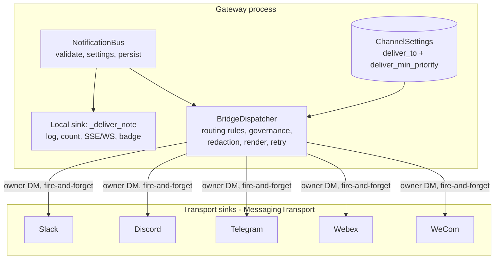
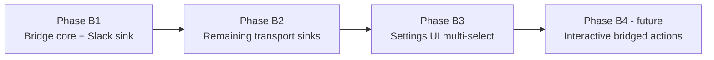

# RFC: Notification Bridge (bus egress fanout to chat transports)

> **Nothing here is built, and its dependency claim is overstated.** The bus
> RFC's phases did not all ship: the phases this bridge actually needs are on
> main, but Phase 2 has no producer and Phase 5 shipped two of three items.
> `docs/system-specs/modules/app-notifications.md` is the record of what the
> bus does today.

- Status: accepted — the document is merged (PR #670) with an open tracking issue, but **zero implementation code exists**. `notifications/bridge.py` and `BridgeDispatcher` do not exist; `ChannelSettings` carries only `muted` + `priority`, with no `deliver_to` / `deliver_min_priority`; egress is still the single hardcoded dashboard sink at `dashboard/state.py:1758`. No open PR and no live branch is building B1–B4.
- Correction to the Summary below: it says the bus RFC's "Phases 1–5, all shipped". Phases 1/3/4 are complete, but Phase 2 has no producer app and Phase 5's kind-routing cleanup is still present in `NotificationDetailPanel.tsx`. Every dependency **this** RFC actually needs is real; the blanket claim is not.
- Author: zezhexu
- Created: 2026-07-28
- Related: rfc-local-notification-bus.md (the bus this RFC extends), issue #589 (tracking), PR #422 (Phase 5 delivery + the withdrawn escalation prototype)
- Supersedes: rfc-local-notification-bus.md "Resolved design questions" #1 (Slack escalation)

## Summary

The local notification bus (rfc-local-notification-bus.md, Phases 1–5, all shipped) built the **ingress** half of a notification system: any producer — gateway modules, cron, subagents, app backends, agent sessions — publishes through one validated entry point. The **egress** half was never generalized: the bus has exactly one hardcoded sink, the dashboard. This RFC adds the missing layer — a **notification bridge** that fans out matching notifications from the bus to the user's connected chat transports (Slack, Discord, Telegram, Webex, WeCom), governed per transport, configured per source channel, unconditional on dashboard presence. Routing, not escalation.

## Motivation

### Current state

Ingress and the bus core are complete:

- Producers: `notify()` adapter (system modules), `POST /api/notifications/app` (app-token producers), `POST /api/notifications/agent` + the `send_notification` MCP tool (agent sessions). All paths funnel through the `NotificationPayload.validate()` trust root.
- Bus core: persistence with TTL sweep, priority tiers, per-channel settings (mute, priority override, sound), group stacking, inline actions.

Egress is a single hardcoded consumer:

```python
# dashboard/state.py
# _deliver_note is the delivery sink (log, count, broadcast, persist).
self.notification_bus = NotificationBus(sink=self._deliver_note)
```

`_deliver_note` appends to the in-memory log, counts unread, broadcasts over SSE/WS, persists, and drives the badge/sound/banner surfaces. Every delivery surface is a dashboard surface.

### History: the withdrawn escalation

The original RFC's Phase 5 included an opt-in Slack escalation: critical + no dashboard client connected → owner Slack DM. It was built in PR #422 and **withdrawn before merge** as wrong-shaped on both axes:

1. **Transport-specific.** A persisted `slack_escalate` boolean names one transport in a product that speaks five. The moment a Discord or Telegram user wants the identical behavior, the settings contract needs migration.
2. **Presence-gated.** "No dashboard client connected" is a point-in-time socket check; a sleeping laptop's stale socket reads as *connected* and silently suppresses the DM (old issue #491). Away-detection was the escalation framing's baggage — what users actually asked for is *"deliver these notifications to this transport too."*

Issues #489 (dead-toggle trap) and #491 (unacked-escalation heuristic) were closed as superseded; issue #589 tracks the replacement this RFC specifies.

### Problems

1. **Away-from-dashboard delivery gap.** A critical notification (an approval blocking an agent turn, a Sev-2 from an app) reaches only the dashboard. Users who live in a chat transport miss it until they next open the app.
2. **No egress seam.** Any new delivery surface must today be bolted inside `_deliver_note` — exactly how the escalation prototype went wrong. The bus needs a second-sink architecture, not a second special case.
3. **Producer workarounds re-emerge.** Without a bridge, producers that want chat delivery route through `send_message` (the pre-bus workaround the original RFC rejected for apps), conflating chat with notifications and bypassing channel settings.

## Goals

- Any **connected** chat transport can be a notification sink, through one transport-generic mechanism.
- Per-source-channel routing rules: which transports, and a minimum priority floor.
- Delivery is **unconditional on presence** — the user asked for fanout; the bridge never second-guesses with a heuristic.
- Every bridged delivery is governance-vetted (`capabilities.messaging` + `channels/<transport>`) and SEL-audited, grant and denial alike, through the `vet_and_audit` seam PR #422 hardened.
- **Local delivery isolation**: bridge evaluation and transport failures can never delay, break, or reorder dashboard delivery.
- **Loop safety**: a bridged delivery never re-enters the bus or a channel agent's inbound path.

## Non-goals

- Away detection or any presence-conditional delivery (explicitly rejected; see History).
- Interactive actions on bridged messages (Approve/Reject buttons inside Slack/Discord). Requires per-transport callback plumbing; future phase, the bridge does not preclude it.
- Digests, batching, or quiet hours (possible later on top of the same routing table).
- Non-chat sinks (email, generic webhooks). The sink contract makes them possible later; out of scope here.
- Cross-instance notification sync.

## Design

### Target architecture



The bus's single `sink=` becomes a composite: the local sink runs first and synchronously (unchanged semantics); the bridge dispatch is scheduled as a tracked background task after local delivery succeeds. The dashboard never waits on a transport.

### Sink contract: reuse `MessagingTransport`

All five transports already implement the Layer-1 `MessagingTransport` contract (`src/kiro_crew/messaging/transport.py`): `slack/transport.py`, `discord/transport.py`, `telegram/transport.py`, `webex/transport.py`, `wecom/transport.py`. The bridge introduces no new transport abstraction:

- **Eligibility** is gated on `TransportCapabilities` — the existing proactive/delayed send-policy flag decides whether a transport may receive bridge deliveries at all.
- **Rendering** uses each transport's renderer and the capabilities' chunking parameters, so a long body degrades per transport instead of assuming one shape. The bridge renders a compact notification form: title, body, priority marker, and the deep-link `url` as text (dashboard-internal routes only, per the bus's existing validation).
- **Target** is the owner's DM with the bot on that transport (v1). Per-transport target configuration (a specific group/channel) is an open question below.

### Routing table

`ChannelSettings` (per source channel, `notifications/settings.py`) gains two optional fields:

- `deliver_to: list[str]` — transport ids, validated against the **known** transport set (`slack`, `discord`, `telegram`, `webex`, `wecom`). Empty/absent = no bridging (today's behavior).
- `deliver_min_priority: "critical" | "default" | "all"` — floor for what routes; defaults to `critical` when `deliver_to` is non-empty. `all` includes passive notes.

Validation against the *known* set (not the *connected* set) keeps persisted config stable when a transport temporarily disconnects; the Settings UI filters the multi-select to connected transports, which kills the enabled-but-dead-toggle trap (old #489) by construction.

### Dispatch pipeline

For each note, after local delivery:

1. **Rule match**: source channel's `deliver_to` non-empty AND effective priority ≥ `deliver_min_priority`. (Effective priority — after user overrides — not producer-declared.)
2. Per matching transport, in a tracked fire-and-forget task:
   a. **Governance**: `vet_and_audit("capabilities.messaging", ...)` and `vet_and_audit("channels", <transport>, ...)`, fail-closed, evaluated for the host surface and the note's originating session where present (tightest wins) — the exact model the escalation prototype validated and PR #422's seam retained.
   b. **Redaction**: `redact_credentials` + `redact_exfiltration_urls` on title and body before egress.
   c. **Render + deliver**: transport renderer, chunked per capabilities, sent to the owner DM with bounded retry for transient failures (per-transport retry policy; the Slack sink reuses `slack/retry.open_dm_with_retry`).
   d. **Audit**: SEL delivery record, success or error, attributed with the note's caller identity.
3. A transport failure logs and audits; it never retries into the local path, never surfaces as a user-facing error, and never affects other transports' deliveries.

### Loop safety

Two invariants, both enforced in the dispatcher rather than trusted to transports:

1. A bridge delivery **never publishes to the bus** — the dispatcher writes to transports only; nothing in its path calls `bus.push` or `notify()`.
2. Bridge sends are marked with a `notification-bridge` origin in transport metadata, and each transport's inbound path already ignores self-authored bot messages — a user *replying* to a bridged DM is an ordinary inbound message to the channel agent, which is fine and useful, but the bridged message itself can never echo.

## Migration plan



### Phase B1: bridge core + first sink (backend only)

- `notifications/bridge.py`: `BridgeDispatcher` with rule evaluation, governance, redaction, retry, SEL audit; composite egress wiring in `state.py`.
- `ChannelSettings.deliver_to` / `deliver_min_priority` with PUT validation (known-transport ids, enum).
- Slack sink adapter (owner DM via existing client + `open_dm_with_retry`).
- Exit criteria: a `critical` note on a routed channel lands as a Slack DM with redacted content and paired SEL records; local delivery latency unchanged (bridge task scheduled, not awaited); loop invariants pinned by tests.

### Phase B2: remaining transports

- Discord, Telegram, Webex, WeCom sink adapters over their `MessagingTransport` implementations; per-transport rendering verified against capabilities (chunking, formatting floor).
- Exit criteria: the same routed note delivers on every connected transport in `deliver_to`; a disconnected transport is skipped with an audited no-op, not an error.

### Phase B3: Settings UI

- "Deliver to…" multi-select per channel row in Settings → Notifications, populated from connected transports only; priority-floor picker appears once a transport is selected.
- Exit criteria: selections persist through the existing settings PATCH; a transport that disconnects later renders as inactive-but-retained in the row, not silently dropped.

### Phase B4 (future, separate proposal): interactive bridged actions

Approve/Reject on the bridged message itself, per transport callback support. Out of scope; listed to show the bridge's rendering path is where it would attach.

## Backward compatibility

| Surface | Guarantee |
|---------|-----------|
| Note schema / JSONL | Unchanged; the bridge is egress-only |
| `ChannelSettings` | New fields optional; absent = exactly today's behavior |
| SSE/WS wire format | Unchanged |
| Dashboard delivery | Byte-identical path; bridge scheduled after, never awaited |
| Transports without bridge config | Untouched; zero proactive sends |

## Security considerations

- Every delivery is double-gated (`capabilities.messaging` + `channels/<transport>`) through `vet_and_audit`, fail-closed, with grant and denial SEL records — the seam and semantics PR #422 shipped and its 23 review rounds hardened.
- Content is redacted before leaving the gateway; deep links remain dashboard-internal path-only routes (bus-level validation, unchanged).
- Routing config mutates only through the existing authenticated settings PUT with strict field validation; transport ids are allowlisted against the known set.
- The bridge grants no new producer capability: it consumes already-validated bus notes. A producer cannot reach a transport it couldn't already reach via governance.
- Attribution: bridged deliveries carry the note's caller identity into SEL, so an agent-produced note's fanout is attributable to its session.

## Alternatives considered

1. **Per-transport escalation toggles** (`slack_escalate`, then `discord_escalate`, …). Built once, withdrawn (PR #422). N booleans × away-detection is the shape this RFC exists to avoid.
2. **Route through `send_message` per transport.** Rejected for the same reason the original RFC rejected it for app producers: it conflates agent chat delivery with notification delivery, bypasses channel settings and priority, and loses notification identity in audit.
3. **Generic webhook sink instead of native transports.** Rejected as v1: users already configured native transports with identity and rendering; a webhook sink is a plausible *additional* sink later, not a substitute.
4. **Generalize to full pub/sub eventing.** Re-rejected (original RFC, alternative 3). The bridge is one structured consumer with a routing table — still not a concrete second consumer for generic pub/sub.

## Open design questions

1. **Per-transport targets.** v1 delivers to the owner's bot DM. Should `deliver_to` entries later accept a target qualifier (`slack:#oncall`)? Deferred until a concrete need; the routing-table shape accommodates it without migration (string ids stay strings).
2. **Producer-side dedup.** A cron that already posts to Slack via `send_message` AND has its channel routed to Slack double-delivers. Carrying trusted delivery provenance on the note (the round-11 deferral from PR #422) would let the bridge suppress duplicates. Deferred — needs provenance plumbing that is independently useful.
3. **Rate limiting.** App producers are rate-limited at ingress (30/5min). Does the bridge need its own egress budget per transport to protect chat surfaces from a routed-`all` firehose? Leaning yes-but-simple: reuse the ingress budget's spirit with a per-transport token bucket in B1.
