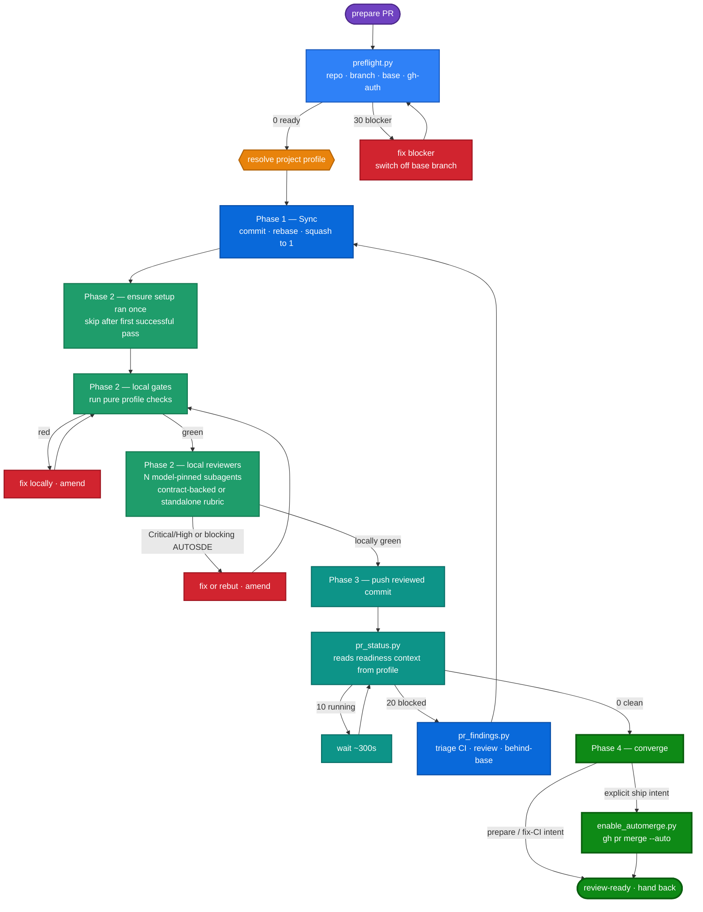
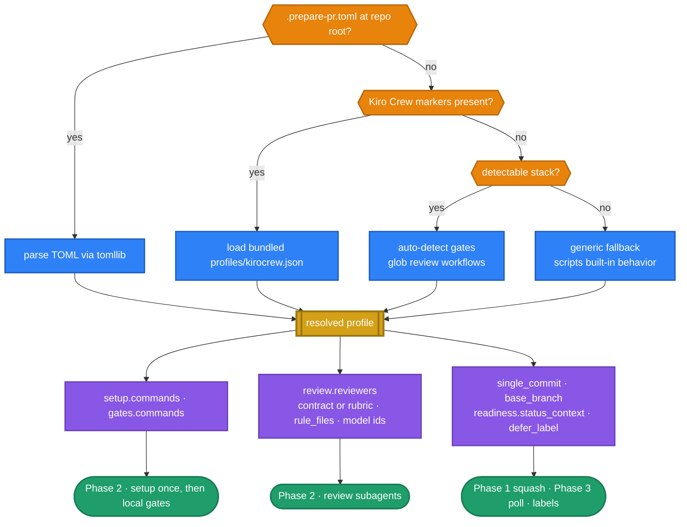

# RFC: Portable `prepare-pr` via Pluggable Project Profiles

> **Current behaviour: see the `prepare-pr` skill's own
> [`SKILL.md`](../../src/kiro_crew/builtin_skills/kirocrew-dev/prepare-pr/SKILL.md)
> and [`../ci/ci-and-reviews.md`](../ci/ci-and-reviews.md).** The profile resolver
> ships as `resolve_profile.py` in that skill's `scripts/` directory and
> implements the four-step resolution order and the `.prepare-pr.toml` schema
> described below, so this document is the decision record. The skill's
> `references/rationale.md` covers rule rationale rather than architecture and is
> not superseded by it.

---

## 1. Problem

The `prepare-pr` skill is one of the most valuable pieces of Kiro Crew's own dev workflow: it drives a working tree to a review-ready PR (commit → sync → squash → open/update → poll CI + review bots → fix legitimate Critical/High findings → converge), and it standardizes how we ship changes to Kiro Crew.

But the skill reads today as specific to **Kiro Crew**. Its prose bakes in one project's conventions, so an agent running it in any other repo would follow instructions that don't apply. We want two things at once, and they appear to be in tension:

1. Keep the skill **built-in** and keep it **standardizing Kiro Crew development** (the tuned setup, gates, review bots, labels, and single-commit rule that make our PRs consistent).
2. Make the skill **useful in any `gh`-based repo**, so other projects benefit from the same commit→green loop.

This doc shows the tension is only in the *prose*, not the mechanism, and proposes a pluggable **project profile** layer that resolves both goals without forking the skill.

## 2. Why it matters

- **Reuse.** The commit→sync→squash→open→poll→fix→converge loop is genuinely project-agnostic. Locking it to Kiro Crew wastes a good abstraction.
- **Standardization stays intact.** A profile lets Kiro Crew keep its exact setup/gates/reviewers/labels as *data*, so Kiro Crew devs get zero-config standardization while other repos get a working default.
- **No parallel systems.** Evolving the one proven skill outward (a discovered profile layer) beats spawning a second `kirocrew-prepare-pr` skill that drifts from the generic one.

## 3. Current state — what is actually coupled

Grounded in a read of the skill's scripts and `SKILL.md`:

### 3.1 The scripts are already ~95% generic

| Script | Coupling to Kiro Crew |
| --- | --- |
| `preflight.py` | **None.** Base branch is auto-detected: existing PR's base → `origin/HEAD` → `main`. Pure `git`/`gh`. |
| `diff_signals.py` | **None.** Changed-file + flagged-signal reporting over `git diff`. |
| `pr_findings.py` | **None.** Failed-step + log-tail + unresolved-thread extraction over `gh`, plus reviewer findings for the current head with a stable `span=` identity (path + reviewer/kind; no file reads -- finding paths are untrusted comment text); the `[<NAME>-REVIEWED]` stamp contract is discovered from the comments, not configured. Its pure compatibility exports come directly from the sibling `_review_contract.py`; only command-running adapters stay local. |
| `enable_automerge.py` | **None.** Thin idempotent wrapper around `gh pr merge --auto`. |
| `pr_status.py` | **One line:** `READINESS_CONTEXT = "PR Readiness"`. And it already **degrades gracefully** — when that aggregate status is absent it falls back to the full check rollup ("legacy PRs without it still use the full rollup"). The reviewer-marker gate (#2550) is likewise self-configuring: it evaluates whatever `[<NAME>-REVIEWED]` stamps bot comments carry (none found → no gate), with `--reviewers` / `PREPARE_PR_REVIEWERS` as the optional scoping seam. The pull_request-run-for-head assertion applies only when the rollup is Actions-shaped AND the repo demonstrably dispatches pull_request-event runs at all — a push-trigger-only repo is never held to an event it does not use. Its pure compatibility exports use the same sibling `_review_contract.py` as `pr_findings.py`; command-running adapters remain entry-local. |
| `_review_contract.py` | **None.** The single stdlib-only implementation of reviewer-marker parsing, finding identity, disposition parsing, and disposition-rule evaluation used by both entry scripts. |

So the executable core already runs anywhere `git` + `gh` are present. Decisions are driven by script **exit codes** (`0 clean / 10 running / 20 blocked / 2 env`), which are project-neutral.

### 3.2 The coupling lives in the `SKILL.md` prose

Everything project-specific is prose the agent reads, not code:

- **Local gates** hardcoded to Kiro Crew's stack: `pytest / isort / flake8 / mypy` + `tsc -b / vitest`.
- **Reviewers** hardcoded to mirror named workflows: `.github/workflows/{codex,claude,code}-review.yml` (no way to add a repo's own reviewers).
- **Rule sources:** `AUTOSDE.yaml` + `website/AUTOSDE.yaml`, `CLAUDE.md`, `AGENTS.md`.
- **Conventions:** the single-commit-per-PR invariant; the `readiness: passed` / `readiness: action required` status + labels; base branch `main`.
- A hard reference to the `kirocrew-worktree-dev` skill's Rule 2 gate.

**Conclusion:** portability is a *content* refactor (split the prose), not a *distribution* change (demote to local) and not a *rewrite* (the scripts stay).

## 4. Goals / Non-goals

**Goals**
- One generic core loop, driven by a **project profile** that supplies the parts that vary per repo.
- The profile is **discovered or configured**, never hardcoded in the core prose.
- **Zero-config for Kiro Crew:** a bundled `kirocrew` profile is auto-selected when the skill detects it is running in the Kiro Crew repo.
- **Working default anywhere else** via auto-detection, degrading to the generic fallback the scripts already implement.
- Keep the skill **built-in** (shipped via `package_data`), **dormant** until invoked, with narrow **intent-phrased triggers**.

**Non-goals**
- Not rewriting the scripts (only a small optional readiness-context override in `pr_status.py`).
- Not forking into two skills.
- Not changing Kiro Crew's actual CI workflows or labels.
- Not building a general plugin marketplace — profiles are simple bundled/local files, not installable third-party packages.

## 5. Design — the pluggable project profile

### 5.1 Three axes a profile supplies

The profile is the single home for everything that varies per repo. The review bots are just the most visible slice:

1. **Local setup and gates** — ordered setup commands that provision prerequisites once per worktree without judging the diff, followed by pure test/lint/type gates on every Phase-2 iteration (Kiro Crew: Playwright browser setup, then `pytest`, `isort`, `flake8`, `mypy`, `tsc -b`, `vitest`).
2. **Local reviewers** — a list of local review subagents, **one spawned per entry** (each pinned to a concrete `spawn_run` **model id**, with a `model_tier` fallback). A reviewer is either **contract-backed** (it mirrors a specific CI gate by reading that workflow's contract, e.g. `codex-review.yml`) or **standalone** (it reviews against an inline `rubric` with no CI counterpart). Reviewers do **not** have to bind to CI — a repo can add local-only reviewers (security, performance, a11y, house style) that no server gate mirrors, and a repo with no CI reviewers at all can still define reviewers by rubric. All reviewers inherit the shared `rule_files` (AUTOSDE / AGENTS.md).
3. **Conventions** — single-commit rule (on/off), the readiness status context name + managed labels, an optional long-term-defer label, and the base branch override.

### 5.2 Resolution order (fail-safe, most-specific-wins)

```
1. Explicit config   →  .prepare-pr.toml at repo root                (highest precedence)
2. Kiro Crew markers  →  load bundled profiles/kirocrew.json
3. Auto-detect stack →  infer gates + glob reviewers from *review*.yml
4. Generic fallback  →  scripts' built-in behavior                   (lowest precedence)
```

Key nuance: **the `kirocrew` profile is NOT an unconditional global default.** It is auto-selected only when the skill detects it is in the Kiro Crew repo (see markers in §5.4). This prevents Kiro Crew's setup/gates/labels from misfiring in an unrelated repo.

### 5.3 Auto-detection rules (config-free path)

When there is no `.prepare-pr.toml`:

- **Gates from ecosystem files:**
  - `pyproject.toml` / `setup.cfg` → `pytest` (+ `mypy`, `flake8`, `isort` if configured)
  - `package.json` → scripts for `test` / `build` / `lint` (e.g. `vitest`, `tsc -b`)
  - `Cargo.toml` → `cargo test` / `cargo clippy`
  - `go.mod` → `go test ./...` / `go vet`
  - `Makefile` with a `check`/`test` target → `make check`
- **Setup:** auto-detection does not infer provisioning; it defaults to `[]` unless the profile declares it explicitly.
- **Reviewers:** glob `.github/workflows/*review*.yml` and create one contract-backed reviewer per gate found. A repo may also declare standalone `rubric` reviewers with no CI counterpart. If neither exists, skip local review and rely on the server poll (the scripts still gate via exit codes).
- **Conventions:** default to single-commit *off* unless a marker says otherwise; base branch from `preflight.py`'s existing detection; readiness context via the `pr_status.py` fallback (full rollup) unless a profile names one.

### 5.4 Kiro Crew marker detection

The `kirocrew` profile auto-selects when the repo root contains the distinctive markers, e.g. **all/most of**: `AUTOSDE.yaml` **and** `website/AUTOSDE.yaml`, the review workflows (`codex-review.yml` + `claude-review.yml`), and the `PR Readiness` status usage. Presence of these is a strong, low-false-positive signal that we are in Kiro Crew (or a faithful fork), so loading the tuned profile is safe.

### 5.5 Profile schema (`.prepare-pr.toml`)

A minimal, stdlib-parseable (Python 3.11 `tomllib`) file. All keys optional; anything omitted falls back to auto-detect then generic.

```toml
[project]
base_branch = "main"          # optional; else preflight.py auto-detects
single_commit = true          # enforce one-commit-per-PR squash

[setup]
# ordered prerequisite commands; run once per worktree, not a diff verdict
commands = [
  "(cd website && npx playwright install chromium)",
]

[gates]
# ordered pure checks; all must exit 0 before a push
commands = [
  "python -m pytest -q",
  "isort --check-only src test",
  "flake8 src test",
  "mypy src/",
  "npm --prefix website run build",
  "npm --prefix website test",
]

[review]
# Shared rule files EVERY reviewer inherits. Both Kiro Crew CI gates
# (codex-review.yml AND claude-review.yml) load base-ref AUTOSDE and read the
# AGENTS.md conventions (root = backend, website/ = frontend). CLAUDE.md is
# intentionally omitted — it holds no rules, only an `@AGENTS.md` import pointer.
rule_files = ["AUTOSDE.yaml", "website/AUTOSDE.yaml", "AGENTS.md", "website/AGENTS.md"]

# Each [[review.reviewers]] entry becomes ONE local review subagent, spawned via
# spawn_run and pinned to `model` (`model_tier` = fallback tier when that exact
# id is unavailable — drop a tier + warn). A reviewer is either:
#   • contract-backed → `contract` points at a CI workflow it MIRRORS, or
#   • standalone      → `rubric` is an inline charter with no CI counterpart.
# Reviewers need NOT bind to CI: add repo-specific local reviewers freely.
# spawn_run concurrency floors at 3 and auto-sizes up from host memory/CPU
# (config agent.max_subagents), so extra reviewers just queue — never error.

# contract-backed — mirrors the GPT CI gate
[[review.reviewers]]
name = "gpt"
model = "gpt-5.6-sol"        # concrete spawn_run model id (served GPT-5.x tier)
model_tier = "gpt-5.x"
contract = ".github/workflows/codex-review.yml"

# contract-backed — mirrors the Claude/Opus CI gate
[[review.reviewers]]
name = "opus"
model = "claude-opus-5"      # mirrors claude-review.yml --model us.anthropic.claude-opus-5
model_tier = "claude-opus-4.8"   # CI's --fallback-model (us.anthropic.claude-opus-4-8)
contract = ".github/workflows/claude-review.yml"

# standalone — a local-only reviewer with no CI gate to mirror
[[review.reviewers]]
name = "a11y"
model = "gpt-5.6-sol"
model_tier = "gpt-5.x"
rubric = "Flag WCAG 2.2 AA regressions in changed UI: missing labels, low contrast, keyboard traps, focus order."

[readiness]
status_context = "PR Readiness"   # optional override; else pr_status.py falls back to full rollup
defer_label = ""                  # optional: a label that formally defers a gate
```

The bundled `profiles/kirocrew.json` encodes exactly this Kiro Crew configuration as a machine-readable profile the resolver loads directly, so Kiro Crew needs no in-repo `.prepare-pr.toml`.

> **Why mirror + multi-model by default (not dimension-split).** Contract-backed reviewers reproduce each CI gate's bar locally, so blocking findings surface pre-push instead of a CI round later; pinning each reviewer to a different vendor buys cross-model blind-spot coverage (the same principle the `llm-council` skill is built on — a same-model panel echoes one bias). Splitting one model across dimensions (correctness vs contracts, the pre-#616 A/B design) adds little as models get stronger, since one capable reviewer covers both in a pass — so the default spends the parallel budget on **model diversity**, not dimension slices.
>
> **This is a default, not a constraint.** The `[[review.reviewers]]` mechanism does not stop anyone from building dimension-based review: a user can define standalone `rubric` reviewers split by concern (a correctness reviewer + a contracts reviewer, exactly the old A/B charters) — with or without any CI gate to mirror. Kiro Crew simply *chooses* to mirror its CI gates by default. Per-dimension charters are especially worth adding for very large diffs, where a single reviewer's attention/context is the bottleneck.

### 5.6 Script changes

- **`resolve_profile.py`** (NEW): implements the §5.2 resolution order and emits the resolved profile as JSON (`{source, base_branch, single_commit, setup[], gates[], rule_files[], reviewers[], readiness{}}`). Stdlib only, Python 3.9+; parses an external `.prepare-pr.toml` via `tomllib` (3.11+) or `tomli`, and errors loudly (exit 2) rather than silently ignoring a config it cannot parse. The bundled Kiro Crew profile ships as `profiles/kirocrew.json` (stdlib `json`, so the marker path needs no TOML parser and works on the 3.10 CI leg). Missing `setup` is normalized to `[]` for backward compatibility.
- **`pr_status.py`:** accepts an optional readiness-context name (`--readiness-context` / `PREPARE_PR_READINESS_CONTEXT`) so a profile can name a non-default aggregate status; **keeps today's fallback** to the full rollup when unset or absent.
- **`_review_contract.py`:** owns the reviewer-marker, finding, and disposition computation once. `pr_status.py` and `pr_findings.py` expose pure helpers as direct aliases; only helpers that execute `gh` retain thin entry-local adapters that pass the command runner.
- All other scripts: unchanged.

### 5.7 Degradation ladder

| Situation | Behavior |
| --- | --- |
| `.prepare-pr.toml` present | Use it verbatim. |
| Kiro Crew markers present | Load bundled `kirocrew` profile. |
| Other repo, detectable stack | Auto-detected gates + globbed reviewers. |
| Profile omits `setup` | Normalize it to `[]`; existing profiles keep their previous behavior. |
| No reviewers (no workflows to mirror, none declared) | Skip local review; rely on server poll (scripts still gate via exit codes). |
| No readiness status | `pr_status.py` uses the full check rollup (existing behavior). |

### 5.8 Diagram — the code-review loop (where the profile plugs in)

The bounded loop is project-agnostic; the **green** nodes are the only places the profile supplies data. Decisions come from `pr_status.py` exit codes, not eyeballing.



Everything outside the green nodes is identical across repos. Swapping the profile re-skins setup, gates, reviewers, and the readiness signal without touching the loop.

### 5.9 Diagram — how configuration (the profile) is injected

Resolution is most-specific-wins (amber decisions); the resolved profile (gold) fans its three axes (purple) into the loop's green nodes.



The three axes (§5.1) map one-to-one onto the loop's green nodes. Anything a profile omits falls back down the resolution ladder (§5.7), so a repo with no config still runs the loop with empty setup, auto-detected gates, and the scripts' generic behavior.

### 5.9 The reviewer-marker grammar (spec of record)

The `[<NAME>-REVIEWED]` / `[BLOCK-MERGE]` markers are a load-bearing contract
between three parties: the review workflows that EMIT them
(`codex-review.yml`, `claude-review.yml`, `design-review.yml`,
`ux-review.yml`), the single parser in the sibling `_review_contract.py`, and
the `pr_status.py` / `pr_findings.py` entry points that CONSUME it through
compatibility exports.
A workflow change that alters the emitted shape silently orphans that parser —
the freshness gate then sees no stamps and stops gating — so any change to
either side must update this section and the shared parser together.
`test_prepare_pr_findings.py::TestReviewContractExports` pins both entry points to
that one contract and pins the emitters to its grammar.

The grammar, one marker per line inside the bot's PR comment body:

- `[<NAME>-REVIEWED] <sha>` — proof the review ran for that commit. `<NAME>`
  is `[A-Z][A-Z0-9_-]*` (e.g. `GPT`, `OPUS`, `DESIGN`, `UX`); `<sha>` is a
  7–40 char lowercase hex prefix of the head SHA (workflows emit the full 40).
- `[BLOCK-MERGE] <sha>` — emitted ADDITIONALLY, only for a blocking verdict on
  that same commit. Never emitted for advisory findings.
- Finding lines start with the literal token `BLOCKING` or `FINDING`, followed
  by `-- <file>:<line>` (GPT lane) or the bold Opus form
  `**BLOCKING — <file>:<line> — <title>**`; the parsers accept `--` or an
  em-dash, optional bold markers, and an absent second separator.

Consumption rules the parsers implement: only comments whose author is a Bot
AND whose login is a trusted marker author count — by default
`github-actions[bot]`, the actor every review workflow posts through, because
`user.type == "Bot"` alone is spoofable by a third-party app that echoes
PR-controlled text (`--marker-authors` / `PREPARE_PR_MARKER_AUTHORS` widens
the allowlist for a repo whose reviewers post under app-specific logins); an
agent's own disposition comments quote these tokens verbatim and are excluded
by both checks; reviewer IDENTITY comes from workflow-authored bytes, never
from model output — each lane's comment starts with its template-written
upsert key (`<!-- codex-ai-review -->` → GPT, `<!-- claude-ai-review -->` →
OPUS, `<!-- design-review -->` → DESIGN, `<!-- ux-review -->` → UX;
`--marker-bindings` / `PREPARE_PR_MARKER_BINDINGS` overrides), and a stamp
counts only when the bound lane's own name matches it, so injected model
output in one lane can never grant another reviewer's freshness whatever
names it emits (its `[BLOCK-MERGE]` still gates from any trusted comment:
injection can deny, never forge); bots update their comment in place, so a
marker naming a
superseded SHA is history, not signal; freshness is OR-ed across comments per
reviewer name. Discovery mode holds every stamp found to freshness but does
not require presence; naming reviewers (`--reviewers` /
`PREPARE_PR_REVIEWERS`) additionally REQUIRES each named reviewer to have a
fresh stamp, so a pinned fleet cannot be silently un-gated by an emitter
drift or a bot that fails to post. Two tests hold the contract together:
`TestReviewContractExports` pins both entry points to the shared contract, and
`test_emitting_workflows_still_carry_the_marker_grammar` pins the emitting
workflows to the markers that contract parses.

The same shared contract owns the **disposition-record grammar**, the writer-side half
of the contract. A repository writer records a ruling on a reviewer finding
as a PR comment whose LEADING bytes are
`<!-- ai-review-disposition target=<lane> head=<sha> -->` — the byte prefix
`codex-review.yml`'s adjudication ledger selects records by — and claims the
one finding it rules on with a `span=<id>` token, the same 12-hex identity
`pr_findings.py` prints for every finding (path + reviewer/kind). The claim
lives on the marker line or a `- **…**` title bullet; span ids inside `> `
quoted lines read as quoted evidence, never as claims. That claim is what
makes the "one comment covers one lane, one rationale covers one finding"
rule mechanical rather than prose: `_review_contract.py` computes the
violations once, and `pr_status.py` evaluates that one computation for BOTH
enforcement points — locally it gates the prepare-pr loop (exit 20), and
`pr-readiness.yml` calls the same script's
`--disposition-gate` mode so a violation also fails the repository's required
`PR Readiness` status, which binds a writer who never runs the loop (#6658).
`pr_findings.py` still exposes the same shared grammar but no longer re-lists
the violations: one evaluation point is what keeps the rule from
growing a third and fourth reading of its own bytes. Each record is validated
against the findings stamped for the head its `head=` says it judged — in the
ordinary fix-then-push round that
is the PRIOR head, since the writer rules on the listing they just read —
and against the current head's, because a record is immutable and the ledger
selects it with no head filter, so it keeps downgrade power on every later
head. The violation classes: a record claiming more than one span, carrying
more than one non-quoted finding-title bullet (two same-kind findings in one
file share a span id, so span dedup alone cannot separate them), a span from
a lane other than its `target=`, a span resolving to no finding on the head
it judged (a fabricated or stale identity), a record claiming no span while
its lane has live findings, and a comment carrying the prefix with an
unparseable marker (gated as malformed because the ledger still consumes
it). Records count only from authors holding write/maintain/admin (the
collaborators permission API — the same authority check the ledger applies,
made for every distinct author with no cap, exactly as the ledger's own
author loop runs); an unverifiable author's records are ignored rather than
gated on (deny-only: a drive-by commenter can never hold a PR hostage), and
the report prints the marker-comment vs verified-writer counts so an inert
check is visible. `codex-review.yml`'s ledger consumes only records naming
its own lane (`target=gpt` in the leading marker), so a record labeled for
another lane cannot downgrade GPT findings — the selection there is what
makes the `target=` label load-bearing for the ledger, and the gate's
unbound-lane exemption is safe because a mislabeled record has no consumer.
Lanes outside the marker bindings, and lanes whose concerns
never parse into `FINDING`/`BLOCKING` lines, have no span identity to claim
and are exempt from the claim requirement (never from the multi-span,
multi-bullet or cross-lane classes); a superseded record whose judged head's
stamps are gone
is not re-litigated — the reviewer has already re-adjudicated the surviving
findings on the new head. The readiness lane keeps both fail directions: an
author it cannot verify is ignored exactly as above (so enforcement scope never
exceeds the ledger's admission scope), and a record set it cannot READ at all
is UNKNOWN — published as `pending`, never as a red, because a transient
comments-API failure must not fail the required status.

## 6. Distribution — keep it built-in

Built-in and portable are **not** in conflict:

- Ship the generic `SKILL.md` + scripts + `profiles/kirocrew.json` via `package_data` (matches the "skills ship as builtins" convention).
- Keep the trigger **intent-phrased and narrow** ("prepare PR", "make it review-ready", "fix CI", …) so the skill stays **dormant** until explicitly invoked and never hijacks unrelated frontend/CSS/generic work.
- Other users get the generic behavior + auto-detection; Kiro Crew devs get the tuned profile with zero config.

## 7. Proposed layout after refactor

```
src/kiro_crew/builtin_skills/kirocrew-dev/prepare-pr/
  SKILL.md                    # generic core loop + "Project profile" section
  profiles/
    kirocrew.json             # bundled Kiro Crew profile (setup, gates, reviewers, labels, single-commit)
  scripts/
    preflight.py
    resolve_profile.py        # NEW — resolves the profile to JSON
    diff_signals.py
    _review_contract.py       # shared marker/finding/disposition contract
    pr_status.py              # + optional --readiness-context / env override
    pr_findings.py
    enable_automerge.py
```

(This whole `prepare-pr/` skill directory is the distribution and copy unit: it ships via `package_data`, and the complete runtime tree is synced to `~/.kiro/crew/skills/…` at startup. The two entry scripts resolve `_review_contract.py` relative to their own `__file__`, so either can still be executed directly from an arbitrary current working directory on Windows or POSIX; copying one entry file without its sibling is not a supported distribution shape. An optional `.prepare-pr.toml` lives at a *consuming* repo's root — not in the skill.)

## 8. Migration & backward compatibility

- Kiro Crew validation behavior is **unchanged**: the `kirocrew` profile preserves the same setup/check commands, reviewers and labels, auto-selected by markers; it now distinguishes provisioning from verdict-producing gates.
- Existing profiles remain compatible: an omitted `setup` section resolves to `setup = []`.
- No `.prepare-pr.toml` is added to the Kiro Crew repo (the bundled profile covers it) — but one *may* be added later to make the config explicit/self-documenting.
- Within the supported complete-skill-directory distribution, the entry CLIs remain backward-compatible: the readiness override is opt-in with the existing fallback intact, helper names and signatures remain available, and direct execution works from any current working directory. A lone copied entry file is not a supported distribution; deployments copy the complete `prepare-pr/` directory so `_review_contract.py` is present.

## 9. Alternatives considered

1. **Fork into `prepare-pr` (generic) + `kirocrew-prepare-pr` (specific).** Rejected: two skills drift; violates the "evolve one abstraction outward, don't spawn a parallel system" principle. The profile layer gives the same separation without duplication.
2. **Extract only the scripts as a generic builtin; leave the prose tuned to Kiro Crew.** Rejected: the scripts are already generic — the *value* being generalized is the loop/prose, so this leaves the actual coupling in place.
3. **Demote the skill to local-only (non-builtin).** Rejected: conflicts with the "ship skills as builtins" convention and needlessly gives up standardization; the coupling is prose, solvable without changing distribution.
4. **Keep as-is.** Rejected: blocks reuse for no benefit; the refactor is modest (prose split + one small script hook).

## 10. Open questions

- **Profile format:** `.prepare-pr.toml` (TOML via `tomllib`) vs a `[tool.prepare-pr]` table inside `pyproject.toml` for Python repos. Leaning TOML root file for language-neutrality.
- **Gate command trust:** running profile-supplied shell commands is arbitrary code execution by design (it's the repo's own dev config). Confirm this is acceptable, or gate first-run on user confirmation.
- **Marker strictness:** how many Kiro Crew markers must match to auto-load the `kirocrew` profile (all vs a quorum) to stay robust across forks.
- **Concrete model ids (verified 2026-07-28):** pinned to the CI gates' own models — `gpt-5.6-sol` (codex-review.yml: `model = "openai.gpt-5.6-sol"`) and `claude-opus-5` primary / `claude-opus-4.8` fallback (claude-review.yml: `--model us.anthropic.claude-opus-5 --fallback-model us.anthropic.claude-opus-4-8`); all confirmed served by `kiro-cli chat --list-models`. Note the bare `gpt-5.6` is NOT served (spawns fail) — the GPT mirror must pin the `-sol` tier. Remaining item is *maintenance*: keep the profile ids in sync when the CI workflow pins are bumped (periodic check or a test asserting parity).
- **Profile-resolution mechanism (resolved):** implemented as the deterministic `resolve_profile.py` helper emitting resolved JSON — chosen for determinism + testability over prose-driven parsing.
- **Model-tier fallback wording:** how loudly to warn when a mirror's pinned `model` id is unavailable and it drops to the `model_tier` fallback (local-green is then weaker than server-green).

## 11. Scope of work (if approved)

- Split `SKILL.md`: generic core loop + a "Project profile resolution" section (§5.2–5.5).
- Add `profiles/kirocrew.json` carrying the current Kiro Crew specifics.
- Add the optional readiness-context override to `pr_status.py` (keep the fallback).
- Decide the profile-resolution mechanism (prose vs `resolve_profile.py`; §5.6) and implement it.
- Document `.prepare-pr.toml` for external repos.
- Verify in a worktree; the change is prose + 1–2 small script changes, no CI-workflow changes.
