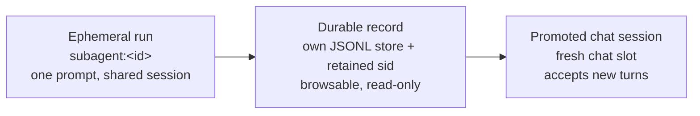
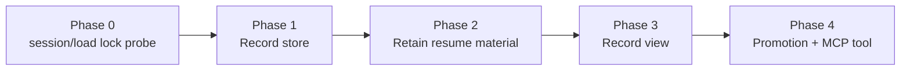

# RFC: Resumable Subagent Sessions

> **Current behaviour: see [`../system-specs/modules/subagent.md`](../system-specs/modules/subagent.md).**
> Continuable conversations shipped instead of the record-store ladder below —
> `spawn_continue`, `keep=`, the follow-up watcher and context-group
> inheritance on continuation are all specified there. This document is the
> record of a probe that changed a design.

- Status: partial, and **what shipped diverges from this plan** — Phase 0 ran and its verdict is recorded in PR #1023's description (a shared-arm sid is *not* loadable after `session/terminate`). That negative verdict redirected the work: instead of the record store → record view → promotion ladder below, PRs #1023 and #1246 shipped **continuable conversations** — `spawn_continue` / `spawn_steer` / `spawn_release` MCP tools, `keep_transcript` on the session handle, and a conversation TTL registry that survives gateway restart. Still unbuilt: Phase 1's record store (no `SubagentRecord`, no records file), Phase 2's `subagent_record_retention_enabled` / `_days` config keys (retention is conversation-TTL based instead), Phase 3's record view (`GET /api/spawn/{id}/record` does not exist), and Phase 4's guaranteed deliverable — promoting a run into an **ordinary chat session labelled a replay**. Note "promotion" in the shipped code means promoting a *conversation's retention*, not seeding a dashboard chat session. This document was never revised after Phase 0; read it as the original plan, not as a description of main.
- Author: zezhexu
- Created: 2026-07-28
- Related: `subagents.md` (current user-facing contract), rfc-local-notification-bus.md (subagent completions as notification producers), #658 / #751 / #752 (subagent surfacing in chat, sidebar, nav rail)

## Summary

Give a subagent run a durable, structured record of what it did, and let a user turn any run into an ordinary chat session they can keep talking to. The spawn hot path is untouched — session sharing stays on, no extra long-lived process per un-promoted run, no change to the concurrency model.

Promotion has one **guaranteed** shape: a new chat session seeded from the run's record and labelled a replay. Full-fidelity continuation via ACP `session/load` is an **upgrade conditional on Phase 0**, which probes whether a session-shared sid is loadable at all. Everything downstream is written so a negative Phase 0 narrows the feature rather than invalidating it.

## Motivation

Code citations below were measured on main `622ada48` (2026-07-29).

### Current state

A subagent run's durable footprint is three files under `~/.kiro/crew/subagents/{id}/`: a `state.json` progress record, a plain-text `result.txt`, and a `tombstone.json` on exit (`src/kiro_crew/subagent_persistence.py:4-6`).

The single enforcement point for non-resumability is one tuple entry. `"subagent:"` is a member of `_STATELESS_PREFIXES` (`src/kiro_crew/session.py:261-275`), which makes `get_or_create` skip the session-map lookup for the run's key (`session.py:2073-2075`), never persist a sid mapping (`session.py:2294-2306`), never arm ACP `session/load`, and bypass the warm pool (`session.py:2093-2099`). Everything else follows:

| Property | Today | Consequence |
|---|---|---|
| Turns | One logical prompt. The retry ladder may re-issue it or send one continuation (`subagent_manager/run.py`, `_stream_with_transient_retry` inside `_run_inner_impl`), but nothing carries a *new* instruction | No HTTP route or MCP tool accepts a follow-up message into a run |
| ACP session id | Persisted to `state.json` under the comment "Record session_id and provider type for session file cleanup" (the `update_state` call in `subagent_manager/run.py`'s `_run_inner_impl`) | Read only by deletion paths (`subagent.py:1187-1192`, `subagent_persistence.py:275-280`). The one artifact needed to resume exists so it can be deleted |
| Transcript | Assistant text chunks only (`write_result_chunk`, called from `subagent_manager/run.py`'s `_run_inner_impl` on assistant-text events), truncated to `RESULT_FILE_MAX_BYTES = 512_000` with an in-file marker (`context_management.py:26,329-352`) | No roles, no prompt, no tool sequence — cannot be rendered as a conversation or replayed into one |
| Prompt | Only the redacted task line, in `state.json` | A run cannot be re-issued from disk |
| Gateway restart | `_reconcile_orphans` (`subagent.py:1115`) identity-verifies the child PID (`subagent.py:1152-1168`), terminates it, tombstones `gateway_restart`, deletes its kiro session files, notifies the parent | Nothing partial is recoverable |
| Retention | `mark_delivered` schedules folder pruning after `agent.subagent_result_ttl_secs` (default 3600, `config/loader.py:755-756`) | Within an hour of success nothing recoverable remains |

The control surfaces match. `spawn_run` / `spawn_sub_agents` / `spawn_list` / `spawn_status` (`mcp_core.py:228,357,288,318`) plus seven routes under `/api/spawn` (`dashboard/server.py:652-660`: create, lost, list, status, delete, retry, clear-all) can start, watch, cancel, and re-run-if-failed. None reads a run as structured messages; none sends into one.

The dashboard has real surfacing as of #658 / #751 / #752: a persistent inline `SubagentRunCard` in the parent transcript, the side-panel Subagents tab, a sidebar count, a nav-rail activity dot, and spawn-approval rows. All of it is anchored to the parent's live turn state — the inline card rehydrates from the tool message's persisted output, the panel from live WS events.

### Problems

1. **A restart loses the record of the work, not just the process.** A 20-minute research subagent killed by a gateway restart leaves a truncated text file and a "consider re-running" message; there is no partial transcript to salvage. Recovering the *running process* is out of scope (Non-goal 1).
2. **You cannot follow up.** The most common reaction to a result is one more question. Today that means re-spawning with a hand-written recap, discarding the run's context.
3. **Tool history is not durable.** `result.txt` holds no prompt and no tool sequence, so "which tools did it run, in what order" is unanswerable from disk after the fact.
4. **Results are not retained.** An hour after delivery a valuable run is gone. (Retention lands in Phase 4, when the retention flag is turned on — Phases 1-3 build the record without extending any lifetime.)
5. **Finished and orphaned runs have no history surface.** Everything #658 added is live-state or parent-transcript anchored. Once a wave is delivered — or a restart orphans it — there is nothing to open.

### Why this is tractable

The resume mechanism already exists and is key-agnostic:

- `SessionMap.set` accepts any key (`session_map.py:178-195`; the whole map is rewritten by `_save`, `session_map.py:110-122`).
- `SessionManager.get_or_create` arms `set_resume_session_id` (`session.py:2189-2196`) before `provider.start()` (`session.py:2203`).
- `AcpRuntime.load_session` implements ACP `session/load`, capability-gated on the backend's `agentCapabilities.loadSession` (`acp/runtime.py:1014,1030-1034`, read at `runtime.py:522`). There is no `--resume` flag; spawn is `kiro-cli acp --agent <name>` plus an optional `--model`, sandbox-wrapped (`acp/runtime.py:406-425`).
- `ConversationLog` is a general append-only JSONL store taking its root as the `base_dir` constructor argument (`history.py:663,694-695`), with cross-process flocks; a class comment names subagent/cron/CLI writers (`history.py:672-690`).
- `build_session_replay` (`context.py:872`) already seeds a fresh session from a stored transcript on provider switches.

## Goals

- Every run **attempts** a durable, structured record — prompt, assistant turns, tool order — that survives a gateway restart and outlives `result.txt`. Record writes never fail a run; a failed or partial write is counted and surfaced.
- A finished or orphaned run is browsable in the dashboard, addressable by URL, and listed after the fact.
- A user can promote any run to an ordinary chat session. The guaranteed outcome is a session seeded from the record and **labelled a replay**. Where Phase 0 proves the sid loadable, promotion upgrades to a full-fidelity `session/load` continuation; where the sid is held by a live process, promotion is **refused**, never silently replayed.
- The spawn hot path keeps its cost profile: session sharing on by default, no dedicated long-lived process per **un-promoted** run, concurrency cap and auto-sizing unchanged. If Phase 0 forces resume to be scoped to dedicated-process runs, that is opt-in **per spawn at the caller's request** — the default stays shared.
- Existing `/api/spawn` endpoints, completion-event delivery, and wave/batch accounting are unchanged; new routes are additive.

## Non-goals

- **Mid-run survival of a gateway restart.** A restart still ends in-flight runs. Recovering a live run requires a dedicated process per resumable run (Alternative 1) and is deferred.
- Resuming the other stateless surfaces in `_STATELESS_PREFIXES` (`session.py:261-275`).
- **Full-text search over records.** Records are listed and opened by id, not indexed. They stay outside the chat-history store, so `search_chat_history` does not see them until a run is promoted (Open question 4).
- **Reconstructing the spawn-time injected context in the replay branch.** A replayed promotion is a new session that has read the record, not a clone of the original. The resume branch carries that context implicitly, because kiro-cli owns the conversation.
- Cross-instance or cross-machine resume.
- User-created subagent sessions. Runs are always spawned by an agent or an operator action.

## Design

### Model

### The record store is separate from chat history

Records are written by a dedicated `ConversationLog` rooted at `~/.kiro/crew/subagent_records/`, keyed by the bare run id.

Two placement decisions, both load-bearing:

- **Not the chat sessions directory.** `ConversationLog.list_sessions` globs every `*.jsonl` in its root with no prefix filter (`history.py:1406-1424`), and that listing has ten call sites across eight modules — `GET /api/sessions` and `api_sessions_clear` (`dashboard/handlers/sessions.py:401,693`), the `list_sessions` MCP tool (`mcp_tools/sessions.py`, `list_sessions`), slot rehydration (`dashboard/chat_persistence.py:326,476`), chat handlers (`dashboard/chat_handlers.py:2252`), folders (`dashboard/chat_folders.py:130`), followup suggestions (`suggestions.py:96`), artifact companion-session resolution (`dashboard/handlers/artifacts.py:696`), and `sync_bridge.py:28` — plus in-class use by `search_sessions` (`history.py:1523,1552`), which is how `search_chat_history` reaches it. Writing records there publishes every run to all of them on day one and puts records inside `api_sessions_clear`'s blast radius.
- **A sibling of `subagents/`, not a child.** `subagent_persistence` treats every child directory of `_SUBAGENTS_DIR` as a run id (`list_orphans` at `subagent_persistence.py:224-241`, `read_state(d.name)` at `:236`), and `"records"` is a legal id, so `delete_agent_folder("records")` would `rmtree` the store.

Record rows use the existing schema. `tools` carries tool **names in order** (`append` types it `list[str]`, `history.py:1029-1037`); per-call arguments and results are out of scope for v1 (Open question 3).

**Layout and write triggers.** Rotation keeps only the metadata line plus the last `_SESSION_KEEP_LINES = 200` messages once a file passes `_SESSION_MAX_BYTES = 2MB` (`history.py:59-60,2263-2320`) — evicted rows are archived, not destroyed, but they leave the live record. So anything that must survive rotation lives in metadata:

| When | What |
|---|---|
| Record creation (spawn) | Metadata: redacted prompt |
| ACP session established | Metadata: sid, cwd, provider, agent — written here, not at terminal, so a run orphaned by a restart is still resume-eligible. The same values are already captured in one `update_state` call in `subagent_manager/run.py` (`_run_inner_impl`) |
| Per completed turn | An assistant row, appended and awaited before the turn is acknowledged |
| Terminal (success, failure, cancel, `_force_reap`, orphan reconcile) | Metadata: tool order, outcome, dropped-row count |

`update_metadata` rewrites the whole file (off-loop variant at `history.py:338`), which is why metadata writes are bounded to these three points rather than backfilled per event.

**One writer per record.** `ConversationLog.append` runs the on-loop persistence guard (`history.py:199-236`, called from `_locked` at `history.py:817`), which raises under dev/strict mode; `append_off_loop` (`history.py:239-283`) dispatches each call to the default thread pool, so per-chunk appends would interleave and each would re-run `_maybe_rotate`. The run's own task therefore owns a bounded in-memory buffer drained by a single writer: awaited per completed turn, drained again in the teardown and reap paths. An over-cap buffer drops oldest rows and increments the dropped-row count. `append_off_loop` forwards only `role`/`content`/`agent` and needs a `tools` passthrough.

**Archive pruning must be scoped.** `_cleanup_old_archives` is throttled by a module-global `_last_cleanup` and defaults its window to `session.archive_retention_days` (`history.py:495,511,528`). The record base passes an explicit `retention_days`, and the throttle is keyed per base dir so a record rotation cannot consume the chat store's prune window.

**Redaction** is at write, single-pass, reusing the redactors the run already applies before it stores its task line and streams its result (`subagent_manager/admission.py`'s `spawn_impl` runs `redact_exfiltration_urls` + `redact_credentials` over the task; the result path applies `subagent.py`'s `_redact` to each assistant chunk in `subagent_manager/run.py`'s `_run_inner_impl`). If redaction raises, the row is dropped, the dropped-row count increments, and the record view labels itself incomplete. A record is never written unredacted.

`result.txt`, `state.json`, and `tombstone.json` keep their current format and role; `result.txt` remains the fast path for `spawn_status` paging/grep and the completion-event pointer. Record-write failures are surfaced through the record's own metadata and the `spawn_status` response — **not** by adding a field to `state.json`.

### Retaining the resume material

The run's sid, cwd, provider, and agent go into the **record's metadata** — not into `SessionMap` at spawn. `SessionMap.set` rewrites the whole map file on every call (`session_map.py:178-195`), so one entry per run would make spawning O(n); and `SessionMap.get` self-prunes entries whose kiro session `.json` is missing or whose `.jsonl` is under 10 bytes (`session_map.py:124-167`). A map entry is written once, at promotion.

Keeping the kiro session files means touching **four** unlink sites:

| Unlink site | Reached by |
|---|---|
| `AcpSessionHandle._cleanup_transcript` (`acp/session_handle.py:799-814`), via `destroy()` (`:775`) | the session-sharing arm — the default — through `AcpSessionProvider.shutdown` (`acp/session_provider.py:173`) from `subagent_manager/run.py`'s `_teardown_run_session_impl` |
| `AcpSessionProvider.cleanup_session` (`acp/session_provider.py:180-200`) | `SessionManager._safe_cleanup` |
| `AcpProvider.cleanup_session` (`providers/acp.py:1124-1141`) | `SessionManager._safe_cleanup` |
| `_cleanup_session_files_sync` (`subagent_persistence.py:293`) | tombstone prune (`:280`) and orphan reconcile (`subagent.py:1187-1195`) |

reached from four subagent call sites: `_teardown_run_session` (`subagent_manager/run.py`, `_teardown_run_session_impl`), `_force_reap` (`subagent.py:2035` — the deadline/stop path, exactly the long run retention exists for), tombstone prune, and orphan reconcile.

`keep_transcript` cannot be a parameter at the point of call: the shared arm calls the `LLMProvider.shutdown` ABC method, and `destroy()` has seven other callers, all non-subagent background sessions (`acp/session_provider.py:126,138`, `suggestions.py:202`, `llm_helpers.py:299`, `tips.py:759`, `dashboard/handlers/cron.py:141`, `apps/builtins/code_review_sage/sage_lib/review_pool.py:490`). It is therefore **per-session-handle** state, not per-provider — a provider instance serves many sessions, so a sticky provider-level flag would retain unrelated background transcripts on disk. It is set on the run's handle before teardown, consumed by `destroy()`, and cleared in a `finally`. `terminate_session` stays unconditional: it is the RSS reclaim on a multiplexed process (`acp/runtime.py:905-926`), and only the unlink is deferred. `release`'s cleanup is already gated on `_SUBAGENT_PREFIX` (`session.py`, passed through to `SessionAllocationService.release` in `session_allocation.py`), so the dedicated arm's change touches no other caller.

Retention is a **new** policy, not an inherited one: `_cleanup_old_archives` prunes archives only (`history.py:511-556`) and live session JSONL is never age-pruned. Two config keys: `agent.subagent_record_retention_enabled` (default **off** through Phase 3, flipped on in Phase 4) and `agent.subagent_record_retention_days` (Open question 1). `result.txt` keeps the existing `subagent_result_ttl_secs` lifecycle and expires first.

The sweeper runs on gateway start and on the existing reaper cadence, reads each record's terminal timestamp from metadata, and deletes expired records plus their retained kiro session files. If the store is unreadable it skips and logs, leaking files rather than destroying resumable state. The synchronous prune path needs no metadata parse — it only asks whether a record file exists for the id, and skips the unlink if one does.

Retained kiro session files are excluded from `/api/usage`, which counts every `*.jsonl` under `~/.kiro/sessions/cli` (`dashboard/handlers/usage.py:389-462`), so usage tallies are unchanged.

### Promotion

Promotion **mints a fresh chat slot through the same slot-creation path the UI uses** and hands it the sid. It does not turn the record into a slot: `_normalize_slot_key` folds `[^\w\-.]` to `_` (`dashboard/state.py:668`) and `_history_key_for` re-namespaces to `dashboard:<slot>` (`dashboard/chat_utils.py:369-375`), so a record-derived slot key would never match the record's identity and `SessionMap.get` could never find the sid. The real slot-creation path is also required for liveness: `_expire_idle` expires any `dashboard:` session whose key is absent from `_active_dashboard_slots` (`session_cleanup.py`, `SessionCleanup._expire_idle`), a set fed only by the dashboard's create/delete/resume/restore path (`set_active_dashboard_slots`, called from `_sync_dashboard_slots` in `dashboard/chat_utils.py`).

Branch selection is on the **load outcome**, not on pre-checks:

1. **Resume** — `session/load` succeeded (`provider.client.resumed`; `AcpSessionProvider.resumed` at `providers/acp.py:609`). No history is materialized into the new slot: kiro-cli holds the conversation, and materializing rows under `dashboard:<slot>` would make a later provider switch or rehydration re-inject as replay the same conversation the backend already has. The slot opens with a "continued from run `<id>`" header linking the record view.
2. **Fail closed** — the load was refused because the sid is held by a live process. Surfaced as a refusal. This needs new state: `_load_session_with_retry` (`providers/acp.py:376`) returns `None` both for a persistent lock (`:443-453`) and for a genuine load failure (`:415-425`), and both set `_history_replay_needed` (`:544`, read at `session.py:2275`) leaving `resumed` false. A `_resume_refused_lock` flag must be set in the exhausted-attempts branch, read beside `resumed` in `get_or_create`, stored on the `_Session`, and returned by the promotion endpoint.
3. **Replay** — no sid, or the load failed for any other reason. The record's rows are materialized into the default chat log under `dashboard:<slot>` so the existing replay path finds history by key (`build_session_replay` reads `conversation_log.recent_chained(session_key, …)`, `context.py:897-902`, against the default log and is not callable over an arbitrary store). The session is **labelled a replay**.

Surfaced as a "Continue as chat" action on the record view and the inline `SubagentRunCard`, plus an MCP tool so an agent can hand a run back as a session instead of pasting a summary. A promoted slot is accounted for exactly like a user-created chat slot — it counts against the dashboard slot budget, never against the subagent concurrency cap.

### Browsing a record

Records are served read-only by their own routes (`GET /api/spawn/{id}/record` and a records list) and rendered as a record view, reachable from the inline `SubagentRunCard`, the Subagents panel, and by URL. Read access is **workspace-global**, consistent with chat history — an explicit decision, not a default inherited from `spawn_status`, which performs no ownership check today (`dashboard/handlers/messaging.py:255-300`).

Records are deliberately **not** dashboard slots. `_ChatSlot.to_dict` emits `"surface": self.mode` as a forward-compat alias (`dashboard/state.py:1459`), so there is no independent surface to assign; `_persist_open_slots` + `restore_open_slots` would rehydrate a record as an ordinary writable slot across a restart; and read-only would be a client-side fiction while the chat send path (`POST /api/chat`, `dashboard/server.py:1660`, slot in the request body) stayed reachable for the id. Consequently no change is needed to the three hard-coded surface **filter predicates** (`ChatPage.tsx:544-550`, `dashboardSlice.ts:280-292`, `chatSlice.ts:668-671`); the sidebar records section is additive in `ChatSidebar.tsx`.

## Migration plan

### Phase 0: Prove whether `session/load` works for the default path

The resume upgrade assumes a sid created as an extra session on a **parent's** runtime is loadable from a new kiro-cli process after that session is terminated, while the parent process is still alive. Nothing in this repo asserts that: `terminate_session`'s contract is kiro-cli's in-memory session map (`acp/runtime.py:905-926`), and `drain_active_turns` documents kiro-cli releasing an on-disk session lock only on a subsequent SIGTERM (the `_DRAIN_ACTIVE_TURNS_TIMEOUT_SECS` comment in `session.py`; the drain itself is `drain_active_turns` in `session_lifecycle.py`).

- Manual probe against real kiro-cli: create a shared session, terminate it, keep the files, `session/load` the sid from a second process while the first lives.
- Deliverable: a **recorded verdict**, plus — if the lock is process-scoped — a decision on whether a lock held by the run's *own parent* relaxes branch 2's refusal into a labelled replay, or stays a refusal.
- Exit criteria: the verdict is written down and referenced by Phases 2 and 4. A negative verdict means branch 1 is unavailable on the default path, and the RFC takes one of two options: **(a)** resume is offered only for runs the caller opted to spawn dedicated, or **(b)** promotion ships replay-only and branch 1 is dropped. Under either option Goals, Phase 2, and Phase 4 read against the recorded verdict, and the guaranteed deliverable (labelled replay) is unaffected.

### Phase 1: Record store (backend only)

- New `ConversationLog` at `~/.kiro/crew/subagent_records/`, keyed by run id, with an explicit archive `retention_days` and a per-base-dir prune throttle.
- Single buffered writer per record with a bounded buffer and a dropped-row count; `tools` passthrough on `append_off_loop`; three metadata writes (creation, session-established, terminal); redact-at-write, fail-closed per row.
- Teach `testing/fake_acp_backend.py` to exercise resume **plumbing**: advertise `loadSession: true`, persist `~/.kiro/sessions/cli/{sid}.json` + `.jsonl` on `session/new`, answer `session/load` with `modes`, handle `session/terminate`, and be able to **refuse** a load so branch 2 is testable. The fake proves wiring only — it cannot substitute for Phase 0's real-kiro-cli verdict.
- `result.txt` / `state.json` / `tombstone.json` and every existing `/api/spawn` response shape unchanged.
- Exit criteria: the `test_subagent*`, `test_native_subagent_spawn`, and `test_mcp_core_spawn_sub_agents` suites pass untouched; `GET /api/sessions`, the `list_sessions` MCP tool, `search_chat_history`, and `api_sessions_clear` are asserted unaffected by a completed run; a run whose record writer raises still completes and delivers, and the failure is counted in record metadata and reported by `spawn_status`; a gateway restart mid-run leaves a readable partial record carrying the prompt metadata and every **acknowledged** turn; a row whose redaction raises is absent, counted, and the record is labelled incomplete; rows for an 8-wide wave are in per-run order.

### Phase 2: Retain resume material

Entry blockers: the Phase 0 verdict is recorded, and Open question 1 (retention days) is answered.

- Per-session-handle `keep_transcript`, consumed by `destroy()` and cleared in a `finally`; the `_safe_cleanup` unlink sites and `_cleanup_session_files_sync` skipped while a record exists for the id; `terminate_session` left unconditional; `_force_reap` covered alongside `_teardown_run_session`.
- `agent.subagent_record_retention_enabled` (default off) + `agent.subagent_record_retention_days`, and the sweeper on gateway start and the reaper cadence.
- Retained kiro session files excluded from `/api/usage`.
- Diagnostics-collector redaction rules extended to cover record and retained kiro session files.
- Exit criteria, all asserted with retention explicitly enabled: after a session-sharing run completes, after a dedicated-process run, and after `_force_reap`, the kiro session files still exist; expired records and their session files are gone after the sweeper; a 100-run soak stays within the retention bound; a **non-subagent** background session's transcript is still unlinked while a subagent record is retained; `/api/usage` tallies are unchanged by retained files; a diagnostics bundle from a machine holding records contains no unredacted transcript. Resume-capability is asserted per the Phase 0 verdict: positive → a real-kiro-cli `session/load` probe against a recorded sid succeeds; negative → the files persist and the replay branch is selected deterministically.

### Phase 3: Record view

Entry blocker: Open question 4 (which records are surfaced) is answered.

- `GET /api/spawn/{id}/record` and a records list endpoint, read-only, workspace-scoped.
- Record view rendering the conversation and tool order; entry points from `SubagentRunCard`, the Subagents panel, a sidebar records section; URL-addressable.
- Exit criteria: a finished run above the surfacing threshold opens from the parent transcript and by URL, renders prompt + tool order, and is still openable after a gateway restart; a run below the threshold is reachable by id; an orphaned run is openable; a rotated record still renders prompt + tool order and is labelled truncated; record ids are absent from `state._slots`, and the current chat send / stop / slot-delete handlers reject a record id with the status those handlers return for an unknown slot.

### Phase 4: Promotion and agent-facing tool

- "Continue as chat": mint a slot through the dashboard's own slot-creation path, copy the sid into a new session-map entry, then resume / fail-closed / replay on the load outcome, materializing record rows only in the replay branch.
- `_resume_refused_lock` plumbed from the provider to the promotion response so the fail-closed branch cannot degrade into a silent replay.
- `agent.subagent_record_retention_enabled` flipped on. MCP tool for an agent to promote a run it spawned.
- Exit criteria: the replay branch and the fail-closed branch are asserted unconditionally — a promotion whose kiro session file was deleted first comes back labelled a replay, and a promotion attempted while the sid is live elsewhere is refused, not replayed. The resume branch is asserted only on the path Phase 0 proved loadable, named explicitly in the test: a follow-up demonstrably retains the run's prior context, and a subsequent provider switch on that slot does not re-inject the conversation as replay. Plus: promoting a run spawned under an auto-approve wave yields a slot whose approval mode is the dashboard default.

## Backward compatibility

| Surface | Guarantee |
|---|---|
| Existing `/api/spawn` endpoints | Request/response shapes unchanged, including the `counted` flag semantics wave accounting depends on. Phase 1 adds record-write failure counts to `spawn_status`; Phase 3 adds two routes (`GET /api/spawn/{id}/record`, records list) |
| `spawn_run` / `spawn_sub_agents` / `spawn_list` / `spawn_status` | Unchanged; `spawn_status` keeps reading `result.txt` with offset/limit/grep |
| Completion-event delivery | Unchanged: same announce text, digest chunking, injection and timeout behaviour |
| Chat history (`/api/sessions`, `list_sessions`, `search_chat_history`, `api_sessions_clear`, folders, suggestions, artifacts, `sync_bridge`) | Unaffected by records — they live outside the chat-history glob root. A **promoted** run's transcript does enter chat history, correctly: it is a real session from that point |
| `result.txt` / `state.json` / `tombstone.json` | Format unchanged — record-write failures are reported through record metadata and `spawn_status`, not by adding a `state.json` field. Lifecycle changes once: prune retains the kiro session files of runs that still have a record |
| `/api/usage` | Tallies unchanged; retained kiro session files are excluded in `_parse_sessions` |
| `_STATELESS_PREFIXES` | Unchanged. `subagent:` stays stateless; execution keys never resume |
| Session sharing | On by default. No un-promoted run is forced onto a dedicated process. If a negative Phase 0 makes resume dedicated-only, dedicated spawning is opt-in per call, never a default |
| Concurrency cap and auto-sizing | Unchanged. A record holds no process and no `_Session`, so the idle sweep (`SessionCleanup._expire_idle` in `session_cleanup.py`, which iterates live sessions only) never sees it. A promoted slot counts against the dashboard slot budget, not the subagent cap |
| Non-subagent background sessions | Unchanged: `keep_transcript` is per-session-handle, so no background session's transcript is retained as a side effect (Phase 2 criterion) |
| Dashboard slot filters | Unchanged; records are not slots and add no surface to the three filter predicates |

## Security considerations

- New at-rest content is the tool-name sequence and its ordering. The prompt matches what `state.json` already stores; assistant output matches `result.txt`. Redaction is at write, single-pass, fail-closed per row (drop, count, label the record incomplete).
- Retained kiro session files are additional at-rest transcripts under `~/.kiro/sessions/cli/`. Retention is bounded and default-off until Phase 4, and the diagnostics collector's redaction rules are extended in Phase 2.
- `keep_transcript` is per-session-handle and cleared in a `finally`. A provider-level flag would retain unrelated background sessions' transcripts on disk; Phase 2 asserts the negative case.
- Record read access is workspace-global by decision, consistent with chat history. This widens exposure relative to `spawn_status`'s id-only reachability, and is documented rather than implicit.
- Records must not be reachable through any chat-slot mutation route. Because they are not slots the guarantee is structural, and Phase 3's criteria assert it against the current handlers.
- Promotion takes the new slot's approval policy from the slot, not from the run's spawn-time approval mode. A run spawned inside an auto-approve wave must not confer auto-approval on the interactive session it becomes (Phase 4 criterion).
- Governance/audit attribution: `sel._infer_source` falls through to `"slack"` for unrecognized keys (`sel.py:856-888`), and `governance_profiles._infer_surface` delegates to it (`platform/governance_profiles.py:212-220`). The record store avoids this by introducing no new session-key prefix; a future revision that does must update `_infer_source`, `_AUDIT_SOURCES` (`sel.py:891`), and record an explicit decision about `_UNATTENDED_SURFACES` (`governance_profiles.py:190`).

## Alternatives considered

1. **Fully resumable runs (drop `subagent:` from `_STATELESS_PREFIXES`).** Rejected as the primary design. It is the only option that survives a mid-run restart, but while a shared run is **in flight** its ACP session is owned by a runtime it does not control, and one sid can be live in only one process — so a resumable run would need a dedicated cold-start process, the cost model session sharing removed, plus idle-sweep exposure and a rehydration contract. This RFC resumes only **after** the run's ACP session is terminated, which is what Phase 0 probes. Returns as its own RFC if mid-run survival becomes a hard requirement.
2. **Records as dashboard slots on a new `subagent` surface.** Rejected on four grounds: `surface` is an alias of `mode` server-side (`state.py:1459`); `restore_open_slots` turns a persisted record slot into a writable one after a restart; read-only would be client-side only while the chat send path stayed reachable for the id; and `_normalize_slot_key`'s fold breaks the record↔sid mapping promotion depends on.
3. **Records in the chat sessions directory.** Rejected: `list_sessions`' unfiltered glob publishes every run to ten call sites on day one and puts records inside `api_sessions_clear`'s blast radius.
4. **Read-only durability with no promotion (Phases 0-3 only).** A legitimate stopping point for browsing and debugging, though retention only turns on in Phase 4, so stopping early leaves Problem 4 unaddressed.
5. **Reuse `POST /api/spawn/{id}/retry`.** Rejected: retry re-runs the original task from scratch, failed runs only. It cannot carry a new question and discards the context the user wants to build on.

## Open questions

1. **Record retention days.** `subagent_record_retention_days` needs a number. Retained kiro session files make this a disk-footprint question as much as a policy one. **Phase 2 entry blocker.**
2. **Where the "continued from run" link lives.** The resume branch opens a slot with no materialized history; whether the link is a pinned system row, slot metadata, or a header chrome element is a UI decision for Phase 4.
3. **Tool-call fidelity beyond names.** v1 records tool names and order. Extending to arguments and result digests changes the row schema and the metadata layout, so it is a follow-up slice, not a Phase 1 option.
4. **Which records are surfaced.** Every run gets a record; the list is the open part. An 8-wide wave of 20-second checks produces 8 entries nobody wants. A candidate rule surfaces only runs past a duration or tool-call threshold, with the rest reachable by id. **Phase 3 entry blocker.**
5. **Records search.** Records are intentionally outside `search_chat_history`. If "find that agent's output from last week" matters, it needs its own index or an explicit extension of chat-history search to a second store — a separate slice, not part of these phases.

## Amendment: 2026-07-29 revision

The draft was written against an earlier main and re-measured on `622ada48`. Three substantive changes:

- **Problem 5 rescoped.** #658 / #751 / #752 shipped persistent inline subagent cards, a sidebar count, a nav-rail activity dot, and spawn-approval rows while this RFC was in draft. The original text claimed subagent output was reachable only as a transient side-panel card. Problem 5 now covers what remains true: everything shipped is live-state or parent-transcript anchored, so finished and orphaned runs still have no history surface. Phase 3's deliverables are unchanged.
- **Phase 0 added.** The resume branch's core assumption — that a session-shared sid is loadable from a second process after termination — is unverified in this repo, so it is now a gate ahead of Phase 1. Phase 2 keeps a downstream regression probe, but the capability question is settled in Phase 0, and Phases 2 and 4 read their resume criteria against its recorded verdict.
- **Promotion re-anchored on the load outcome.** An earlier draft selected the branch from pre-checks (sid present, file exists), which mis-routed an unloadable-but-present sid into the resume branch and a short transcript into an empty session. Branch selection is now on what `session/load` actually returned.
