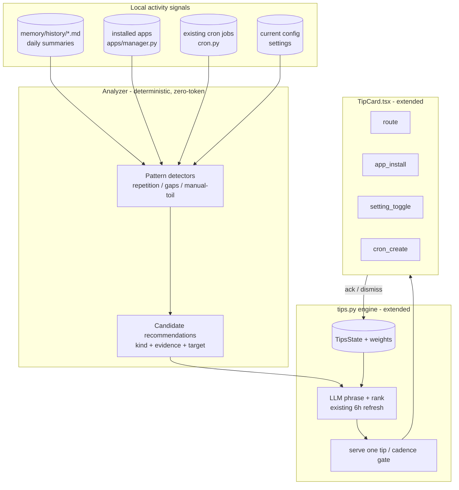
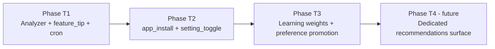

# RFC: Tips Kit (activity-aware, self-learning recommendations)

- Status: draft — **nothing from this RFC is on main.** T1 was fully implemented in PR #775 and then **retracted 42 minutes later despite green CI**, because its `_FEATURE_RULES` regex table made feature matching a hardcoded rulebook instead of LLM-driven, and because `tips_appearance_decay` keyed off id-keyed state that resets every 6h regeneration. The work survives on branch `feat/tips-kit-t1` @ `a9c84a5c`; no successor PR is open. T2 and T3 are unstarted. `tips_analyzer.py`, `CandidateRec`, `cron_create`, `setting_toggle` and `TipsState.weights` have zero hits repo-wide; `_TIP_ACTION_KINDS` is still `("route",)`.
- **Unresolved tension:** the Design section below prescribes *deterministic detectors* with the LLM only phrasing and ranking, and Alternative 2 explicitly rejects LLM-led analysis. That is the shape #775 was retracted for. A faithful T1 implementation of this text would reproduce the rejected design — the doc needs revising before T1 is re-attempted.
- **Baseline correction:** the claim that the engine "never analyzes the daily history" is imprecise — `tips.py:504` already reads `memory/history/*.md` and feeds it to the LLM. What is missing is deterministic pattern detection over a wider window. Also unmentioned: `_TIP_ALLOWED_FIELDS` (`tips.py:515`) excludes `action`, so LLM-authored executable targets require widening that projection first.
- Author: zezhexu
- Created: 2026-07-29
- Related: `src/kiro_crew/tips.py` (the feature-tips engine this RFC extends), rfc-federated-app-platform.md (App Store install path), rfc-local-notification-bus.md + rfc-notification-bridge.md (delivery seam), `cron.py` (scheduling target)

## Summary

KiroCrew already ships a **feature-tips engine** (`tips.py`): every 6 hours it reads the user's context and recent memory, generates memory-personalized tips from a docs catalog, and surfaces them one at a time in the chat view with a glow/snooze/dismiss cadence. Tips today carry at most a `{kind: 'route'}` one-click action that navigates to a Settings tab or page.

This RFC promotes that engine from **feature discovery** to a **recommendation system** — the "Tips Kit". It adds a background **analyzer** that reads what the user actually does day to day (the daily memory history), and four recommendation kinds delivered through the existing tip card — three **executable** and one **educational**:

1. **App** — "you keep doing X by hand; install *Y* from the App Store" → one-click install.
2. **Setting** — "enabling *Z* fits how you work" → one-click toggle.
3. **Cron** — "you run this every morning; schedule it" → one-click cron creation.
4. **Feature tip** — "you've been doing X manually across turns; you can use `/goal`" → navigate/learn-more (the informational kind — capability discovery, no side effect).

The first three *do* something; the fourth *tells* the user about a built-in capability that fits what they are doing. Crucially, the fourth kind is not a static-catalog tip retrofitted — it is **activity-grounded** the same way the executable kinds are: the analyzer detects a manual workflow that a built-in feature (`/goal`, `/compact`, spawning sub-agents, `monitor`, watch-style crons…) would streamline, and surfaces *that* feature at the moment it is relevant, rather than a generic "did you know" from the docs pool. The three executable kinds are illustrative, not exhaustive — the kind set is designed to grow.

Every recommendation is grounded in an observed activity pattern; the three executable kinds require explicit user consent before their side effect runs (the feature tip has none), and all feed a **learning loop**: accept raises a recommendation family's weight and can persist a preference; dismiss suppresses it. The system gets more accurate the longer it runs, without any data leaving the machine.

## Motivation

### Current state

`tips.py` is a mature, defensively-hardened engine (28+ review rounds):

- **Catalog**: a bundled + live-scanned pool of feature docs (`_scan_docs_catalog`, `TIP_DOC_ALLOWLIST`) plus a hand-authored curated pool (`tips_curated.json`).
- **Generation**: an LLM pass every `_REFRESH_INTERVAL_SECS` (6h) that reads `ContextBuilder` output + recent memory and writes action-first tips, avoiding previously shown/dismissed ones.
- **Cadence & state**: `TipsState` tracks `shown`/`dismissed`/`dismissed_docs`/`snoozed`/`opted_out` with doc-stable identity, persisted owner-only to `tips_state.json`.
- **Surface**: `TipCard.tsx` renders one tip above the composer, gated by `useTipTrigger` (20-min client floor, per-turn, suppressed by functional surfaces, blocked in temporary sessions). A tip may carry `action: {kind:'route', label, route}`, validated to internal paths only (`tipActionRoute`).
- **Feedback**: `POST` tips feedback with `shown` / `ack` / `dismiss` / `optout`.

So the engine already has: activity-adjacent personalization, a consent-respecting cadence, a one-click action seam, doc-stable suppression, and a memory-privacy posture. What it does **not** have:

1. **Real activity grounding.** Generation reads `ContextBuilder` (preferences, projects, a memory slice) but never analyzes the *daily history* (`memory/history/*.md`) to detect behavioral patterns — "this user files a ticket every standup", "this user manually greps logs daily". Tips are about features that exist, not about what the user repeatedly does.
2. **A single, catalog-bound action.** `route` navigates, and the informational tips it carries are drawn from the static docs catalog, not from what the user is doing. There is no executable kind (install an app, flip a setting, create a cron — the three things a recommendation most naturally resolves to), and even the educational tips are generic rather than surfaced *because* the user is doing something a feature would streamline.
3. **No learning from outcomes.** `ack`/`dismiss` drive suppression, but there is no weighting: dismissing "cron" tips five times does not down-rank the whole cron *family*, and accepting an app recommendation does not teach the system the user welcomes app suggestions.

### Problems

- **Passive discovery.** A user who greps the same logs every morning is never told "there's an app / a cron for that" unless they happen to read the doc a generic tip links to.
- **Dead-ends at the point of intent.** Even when a tip names the right feature, acting on it is a manual, multi-step chore (open Settings, find toggle; or open App Store, search, install). The moment of intent and the action are separated.
- **No compounding.** The engine cannot get *personally* better; it re-derives from static memory each cycle with no outcome signal.

## Goals

- A background **analyzer** derives candidate recommendations from **observed daily activity** (local `memory/history/*.md`), not just from the feature catalog.
- Three new **executable** tip action kinds — `app_install`, `setting_toggle`, `cron_create` — each executed through the existing tip card, each **consent-gated** (the action never runs on generation, only on an explicit user click that then confirms) — plus an **activity-grounded educational kind**, `feature_tip` (the existing `route`/informational tip, now surfaced *because* the analyzer saw a manual workflow a built-in feature would streamline). The kind set is open — designed so a new kind is a new detector + a new card renderer, not a new engine.
- A **learning loop**: per-recommendation-family weights adjust on `ack`/`dismiss`; a strong accept may persist a durable preference (via the lessons store) so the recommendation becomes a standing behavior instead of a repeated suggestion.
- **Zero egress.** Analysis runs entirely on-device against already-redacted daily summaries; no new data source leaves the machine (consistent with KiroCrew's local-first posture).
- **Reuse, don't fork.** The cadence model, `TipsState` suppression, the card surface, and the feedback endpoint are extended, not duplicated.
- **Cheap by default.** The pattern-detection pass is deterministic (no tokens); the LLM is used only to phrase and rank a small candidate set, on the existing 6h cadence.

## Non-goals

- **Autonomous execution.** The Tips Kit never installs an app, changes a setting, or creates a cron without an explicit, in-the-moment user click + confirmation. It surfaces and prepares; the human commits.
- **New telemetry / analytics egress.** No usage data is sent anywhere; "activity" means the local daily history the user's own agent already writes.
- **A separate recommendations panel or inbox.** v1 reuses the single above-composer tip card. A dedicated surface is a possible later phase, not this one.
- **Cross-workspace or cross-instance learning.** Weights and preferences are per-workspace, like the rest of memory.
- **Recommending arbitrary third-party apps.** App recommendations are drawn only from the installed App Store registry (`apps/app-registry.json`), never invented.

## Design

### Target architecture



The analyzer is a new deterministic stage that produces *candidate recommendations*; the existing engine ranks/phrases them alongside catalog tips and serves them through the unchanged cadence gate; the card gains three executable action kinds plus an activity-grounded educational kind; outcomes feed weights back into `TipsState`.

### The analyzer (new: `tips_analyzer.py`)

A deterministic pass — **no LLM, no tokens** — run at the head of the existing refresh cycle. It reads the last N days of `memory/history/*.md` (the same owner-only daily summaries `Memory.append_history` writes; already redacted, never raw transcripts) plus three "already-have" sets and emits `CandidateRec` records:

```python
@dataclass
class CandidateRec:
    kind: str            # "app_install" | "setting_toggle" | "cron_create" | "feature_tip"
    family: str          # stable weighting key, e.g. "cron:standup-briefing"
    evidence: str        # the observed pattern, in plain words (goes into `why`)
    target: dict         # kind-specific payload (see Execution seams)
    strength: float      # detector confidence 0..1
```

Detectors are small and explainable, e.g.:

- **Repetition → cron**: the same intent recurs at a similar time across ≥3 days ("summarize #eng", "check my tickets") and no cron already covers it → `cron_create` candidate.
- **Manual toil → app**: activity matches an installed-registry app's capability the user has *not* installed → `app_install` candidate (registry only; never invents an app).
- **Config gap → setting**: an observed friction maps to a known toggle the user has left at default (e.g. heavy parallel work + `session.pool_size` at 1) → `setting_toggle` candidate.
- **Manual workflow → built-in feature**: an activity shape maps to a KiroCrew capability the user isn't using → `feature_tip` candidate. Examples: a long multi-step task driven turn-by-turn across a session → `/goal`; a session grown large/slow → `/compact`; repeated independent parallel work done serially → spawning sub-agents; "keep checking X until Y" phrasing → `monitor`/watch cron. This is the educational kind — its `target` is a route or a `cta_prompt`, never a side effect. It differs from a static-catalog tip in that the *feature* is chosen from the observed workflow, not picked round-robin from the docs pool.

Candidates whose `family` is dismissed or whose `target` already exists (app installed, cron present, setting already non-default) are dropped before ranking. This is the same "already-have" suppression the app detector needs and the cron detector needs, centralized once.

### Ranking & generation (extend `tips.py`)

The candidate list is passed into the existing generation prompt as an additional, **higher-priority** input than the static catalog: activity-grounded candidates outrank generic feature tips. The LLM's job narrows to (a) phrasing each candidate as an action-first tip in the established doc-register tone, and (b) ordering by `strength × family_weight`. Generated tips keep the existing schema plus a typed `action`:

```jsonc
{
  "id": "cron-standup-briefing",
  "kind": "cron_create",
  "title": "Schedule your morning ticket check",
  "body": "You've asked for a ticket summary around 9am on 4 of the last 5 weekdays. This can run on a schedule instead.",
  "why": "Observed: 'check my tickets' each weekday morning this week.",
  "action": { "kind": "cron_create", "label": "Create this cron", "target": { … } }
}
```

### Execution seams (the action kinds)

The three executable kinds are **prepare-then-confirm**: the card click opens a confirmation (prefilled from `target`); only on confirm does the backend call the seam. No side effect is ever taken at generation time. The educational `feature_tip` kind takes no side effect at all — it navigates or drops a ready-to-send prompt, exactly like today's `route` tip.

| Kind | Side effect? | Confirm UI | Backend seam |
|------|--------------|-----------|--------------|
| `app_install` | yes | App detail / install sheet, prefilled with the registry entry | `apps/manager.py::install_app(source)` |
| `setting_toggle` | yes | Settings row focused + the proposed value shown as a diff | existing authenticated config PUT (allowlist-validated) |
| `cron_create` | yes | Cron composer prefilled with name/schedule/message | `cron.py::CronService.create(...)` |
| `feature_tip` | no | none — navigates (`route`) or pre-fills a `cta_prompt` | none (today's `tipActionRoute` path) |

The card's action validation (`tipActionRoute` today) generalizes to a discriminated union; each kind validates its `target` shape defensively the same way `route` is constrained to internal paths, because tips can be LLM-authored:

- `app_install.target` must name an app **present in the registry** (reject otherwise).
- `setting_toggle.target` must name a key **in the config allowlist** with a value passing that key's validator.
- `cron_create.target` is passed to the cron composer as a *draft* — it is never registered directly from the tip; the user reviews the schedule and message and presses create.
- `feature_tip.target` is an internal route (validated exactly as `route` is today) and/or a `cta_prompt` string; it can reach nothing off-origin and takes no action on its own.

### The learning loop

`TipsState` gains a bounded `weights: dict[str, float]` keyed by `family` (default 1.0):

- `ack` (accepted/clicked-through): `weight *= 1.5` (capped), and — for a repeated strong accept of the same family — offer to persist a durable **preference/lesson** so the behavior becomes standing (e.g. "user wants morning ticket briefings" → written via the lessons store, after a second confirmation).
- `dismiss`: existing doc/family suppression **plus** `weight *= 0.5` for the family, so the *category* down-ranks, not just the one phrasing.
- `optout`: unchanged global off switch.

Weights multiply detector `strength` at ranking time, so the pool self-tunes to the kinds of recommendations this user actually acts on. Weights are pruned/bounded like the other `TipsState` maps and are per-workspace.

### Cadence, surface, privacy

- **Cadence**: unchanged. Same 6h backend refresh, same 20-min client floor, same per-turn/suppression/temporary-session gating in `useTipTrigger`. Recommendations flow through the identical serve path — they are just higher-signal tips.
- **Surface**: the same single tip card. The three executable kinds render as the same accent action button that `route` uses today, with kind-appropriate labels/icons; the `feature_tip` kind renders exactly like today's informational tip (navigate / Learn more).
- **Privacy**: the analyzer reads only `memory/history/*.md` (owner-only, already-redacted daily summaries) and local state (installed apps, crons, config). No transcripts, no egress. Temporary sessions remain fully blocked (existing `blocked` path), since recommendations are memory-derived.

## Migration plan



### Phase T1: analyzer + `feature_tip` + `cron_create` (highest-value, lowest-risk kinds)

- `tips_analyzer.py`: history reader + the repetition detector (→ cron) and the manual-workflow detector (→ feature tip) + "already-have" suppression, emitting `CandidateRec`.
- Wire candidates into the generation prompt as a prioritized input.
- Card: generalize `action` to the discriminated union; ship `feature_tip` first (no side effect — it is today's `route` path, now activity-grounded), then `cron_create` (prefill the cron composer draft, create via `CronService.create` only on user confirm).
- Exit criteria: a manual workflow surfaces the matching built-in feature (`/goal`, `/compact`, spawn, monitor) grounded in real history; a recurring daily intent surfaces as a cron recommendation; clicking the cron opens a prefilled draft and nothing is scheduled without confirm; dismissing either suppresses the family; analyzer runs zero-token.

### Phase T2: `app_install` + `setting_toggle`

- App detector (registry-capability match against installed set) and config-gap detector (allowlist keys at default vs observed friction).
- Card confirm flows for install (`install_app`) and toggle (config PUT), each with defensive `target` validation (registry membership / allowlist + validator).
- Exit criteria: an uninstalled registry app whose capability matches observed activity is recommended and installs on confirm; a defaulted setting that fits the workflow is recommended and toggles on confirm; both reject malformed/out-of-allowlist targets.

### Phase T3: learning weights + preference promotion

- `TipsState.weights` with `ack`/`dismiss` multipliers feeding ranking; bounded + pruned.
- Second-confirmation promotion of a strongly-accepted family into a durable lesson/preference.
- Exit criteria: repeated dismissal of a family measurably down-ranks that kind; repeated acceptance surfaces a "make this a standing preference?" confirm that, on accept, writes a lesson.

### Phase T4 (future, separate proposal): dedicated surface

A recommendations inbox/panel (review multiple at once, history of accepted/dismissed). Out of scope; the candidate/weight model is where it would read from.

## Backward compatibility

| Surface | Guarantee |
|---------|-----------|
| `tips_state.json` | New `weights` field optional; absent = 1.0 everywhere, i.e. today's ranking |
| Tip schema | `kind`/typed `action` additive; a tip with no `action`, or `kind:'route'`/`feature_tip`, behaves exactly as today |
| Cadence / `useTipTrigger` | Unchanged gate, floor, suppression, temporary-session block |
| Feedback endpoint | `shown`/`ack`/`dismiss`/`optout` unchanged; weights piggyback on existing `ack`/`dismiss` |
| Opt-out | Global tips off switch disables the whole Kit, unchanged |
| Docs-catalog tips | Still generated; activity candidates rank above them but never replace the pool |

## Security considerations

- **No autonomous side effects.** Install / toggle / schedule run only on an explicit user click followed by a confirm; the tip merely prepares a draft. This is the core safety invariant.
- **LLM-authored targets are untrusted.** Every `action.target` is validated before any execution: `app_install` against registry membership, `setting_toggle` against the config allowlist + per-key validator, `cron_create` only as a draft the user must submit through the normal cron path (never registered from the tip directly) — the same defensive stance `tipActionRoute` takes on routes today.
- **Reuses existing authz.** Install goes through `install_app` (App Store admission unchanged); config changes go through the authenticated, allowlisted config PUT; cron creation goes through `CronService` (its existing validation and SEL audit apply).
- **Privacy.** Analyzer input is owner-only, already-redacted daily summaries plus local state; no transcripts, no egress. `tips_state.json` stays owner-only (0600 + `restrict_to_owner`). Temporary sessions stay blocked.
- **No new producer capability.** The Kit consumes local signals and drives already-guarded seams; it grants no path a user did not already have.

## Alternatives considered

1. **A standalone recommendation agent** (separate cron/subagent, own surface). Rejected for v1: it would duplicate the cadence, suppression, opt-out, and card infrastructure `tips.py` already hardened over 28 rounds, and split the user's "why am I seeing this" mental model across two surfaces. Extending the proven engine is lower-risk; a dedicated surface stays as Phase T4.
2. **LLM-only analysis** (feed raw history to the model, let it find patterns). Rejected as the primary path: costly (tokens every cycle over growing history), non-deterministic, and hard to explain ("why did it recommend this?"). Deterministic detectors produce auditable evidence; the LLM only phrases and ranks a small candidate set.
3. **Auto-execute high-confidence recommendations** (e.g. silently create a cron above some strength). Rejected outright — side effects without a click violate the consent posture and the production-safety norms; the human always commits.
4. **A new `recommendations.json` store parallel to tips.** Rejected: forks state, cadence, and suppression. Candidates are transient inputs to the existing pool; only per-family `weights` persist, inside `TipsState`.
5. **Recommend arbitrary apps via web search.** Rejected: recommendations must be installable and trusted; the source of truth is the App Store registry, not the open web.

## Open design questions

1. **History window & detector thresholds.** How many days back, and what recurrence count/strength floor before a pattern becomes a candidate? Leaning ~14 days and ≥3 occurrences for cron; needs tuning against real history to avoid noise.
2. **Preference-promotion trigger.** After how many accepts of a family do we offer to persist a standing preference — and is one lesson per family too coarse? Deferred to Phase T3 with a conservative default (≥2 strong accepts, explicit second confirm).
3. **Cron draft vs. direct create.** v1 always opens a prefilled draft the user submits. Is a "create exactly this" one-click (still confirmed) worth it for high-confidence cases, or does draft-always keep the safety story simpler? Leaning draft-always for v1.
4. **Setting-toggle reversibility surfacing.** Should a `setting_toggle` confirm always show the current→proposed diff and a one-click revert breadcrumb, given settings changes are the least visible of the three? Leaning yes.
5. **Weight decay.** Should family weights decay toward 1.0 over time so an old dismissal doesn't suppress a category forever as the user's work changes? Probably yes, slow half-life; deferred to T3.
