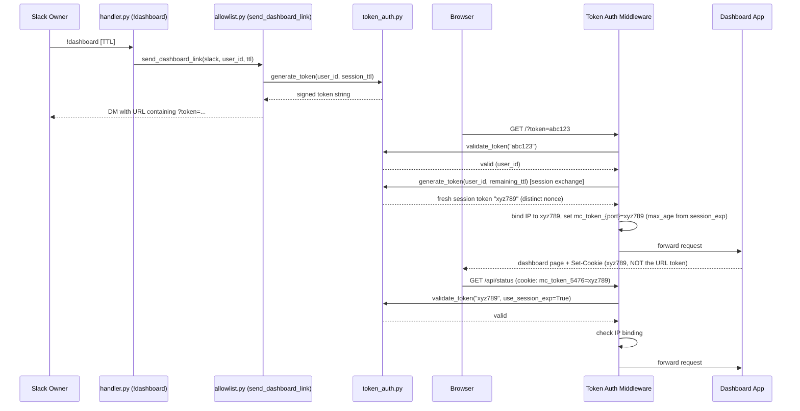
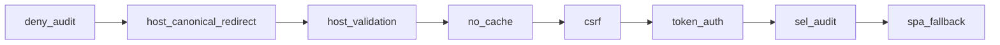

# Dashboard Token Authentication — Design Document

## Overview

Token authentication for the Kiro Crew dashboard. The owner mints a time-limited, HMAC-SHA256 signed URL from the CLI (`kirocrew token`) or via the `!dashboard` Slack command (currently the only chat channel that mints links). An aiohttp middleware validates the token on every GATED request (query param or cookie fallback) and sets a session cookie on first use. A bypass route returns before validation, and that set is wider than static assets — see the bypass inventory below. The token is pinned to a peer key: the client address by default, or a `ts:node:` / `ts:login:` identity on a Tailscale path (`token_auth.TokenStateManager.bind_peer()`), so the pin is not always an IP. Ordinary loopback requests require token authentication (`token_auth.token_auth_middleware()`; `test_loopback_requires_token`). Internal routes have separate loopback-plus-`X-Internal-Secret` and mixed-route cookie-authentication branches. SEL coverage of token GENERATION is per caller, not intrinsic to minting: `generate_token()` itself logs only `nonce_evicted`, an eviction side effect, so a caller that does not log leaves its mint unaudited. The gateway's `--json-ready` startup path is that case — it calls `generate_token()` directly with no accompanying generation event.

`TokenStateManager` bounds concurrently valid link nonces with FIFO eviction, allowing multiple browser tabs and CLI sessions without unbounded link-state growth (`token_auth.TokenStateManager`). All in-memory link-session state is managed by that thread-safe component. Auth is **not** purely in memory: the persistent HMAC signing key `token_signing.key` and persisted revoked access-cookie nonces in `token_revoked_nonces.json` let signed cookies and per-session logouts survive a gateway restart. `POST /api/auth/logout` revokes one access cookie and its refresh chain; `kirocrew logout` advances the persisted revocation generation embedded in both token kinds, ending all established browser sessions and refresh chains (`token_secret`, `RevokedNonceStore`, `revocation_gen.py`).

The dashboard also issues a paired **refresh cookie** (`mc_refresh_{port}`, HttpOnly, path-restricted to `/api/auth`) alongside the access cookie on initial token-URL use. The SPA calls `POST /api/auth/refresh` before the access cookie expires to rotate both cookies, so an active browser can continue without another `!dashboard` / `kirocrew token` link. Refresh tokens are HMAC-signed with the persistent `token_signing.key`; `RefreshStateManager` permits only the chain-head replay under its source-IP grace conditions, and any other consumed-`jti` replay revokes the chain (`test_tr_u_22a_grace_accepts_only_chain_head`).

An existing dashboard session can recover another browser with `POST /api/auth/mobile-link`. The endpoint requires the normal access-cookie session and an allowed same-origin request; it refuses unauthenticated and app-scoped callers. It returns a normal signed URL token plus `Cache-Control: no-store`; the browser uses that token through the ordinary link-to-cookie exchange, which establishes a separate access cookie and a refresh chain. The dashboard presents this as **Settings → Security → Sign in on mobile**, so a mobile browser whose storage was cleared can be restored without exposing a raw token prompt. The returned link has the normal five-minute click window, is built only from the configured external dashboard origin, and must be transferred only to the intended device.

The refresh scheduler is mounted by `DashboardBootstrap` outside the first-run
Kiro CLI prerequisite gate. A cold browser with a stale access cookie can
therefore rotate its refresh cookie even while the main dashboard tree is not
yet mounted, rather than being trapped behind the setup screen.

The first-run Kiro CLI routes (`GET /api/kiro-prerequisite` and
`POST /api/kiro-prerequisite/repair-specs` — Kiro Crew neither installs the CLI
nor signs in, so there is no install or login route) are deliberately **not**
token-bypass or internal-secret routes. They inherit normal dashboard-user authentication,
Host validation, POST CSRF protection, app-token deny-by-default scoping, and
SEL API auditing. Each handler also rejects every non-empty app claim even if
the app manifest declares this API prefix. The browser's
`X-Session-Key: dashboard:ui` is correlation metadata, not authorization.

### Multi-tab grace window (chain-head-only)

Rotation-on-use races when a refresh POST is duplicated (network retry / double-fire) or two tabs sharing one cookie jar fire near-simultaneously: tab A refreshes `jti1→jti2`, and the just-consumed `jti1` is presented again. To avoid falsely revoking the whole session on this benign single-refresh race, `RefreshStateManager` retains **exactly one** recently-consumed jti per chain — the single most-recently-rotated one (the **chain head**) — together with its freshly-minted replacement pair. `grace_replacement()` accepts a replay **only when the presented jti equals that chain head**, subject to same-source-IP and the 60s window, and re-serves the head's replacement pair (which carries the current live, not-yet-consumed refresh token) instead of minting another rotation. Each consumption overwrites the entry, so the retained pair is always the live head and a slow response can never roll the shared jar back to an already-consumed jti.

**Reuse-detection posture:** Grace is chain-head-only: only the most recently consumed `jti` can receive the live replacement pair under the source-IP grace conditions; replay of an older rotated `jti` is token reuse and revokes the chain (`test_tr_u_22a_grace_accepts_only_chain_head`). The accepted trade is multi-tab UX: a second stale tab can be logged out after another tab rotates the chain. `_client_ip` is `request.remote`, following `X-Forwarded-For` only where the deployment trusts it. The grace entry is in-memory only, so a gateway restart drops the entry and a lagging tab re-mints via the token URL. Any change to the chain-head-only rule, to `_client_ip`/XFF trust, or to head-serving behavior changes this security contract and must update this section in the same commit.

### Refresh rate-limit bucket bounding (fail-closed cap)

`POST /api/auth/refresh` is rate-limited per source IP. The per-IP bucket map is bounded two ways: a periodic sweep reclaims stale or empty buckets without evicting a live bucket, and a hard cap fails closed so a previously unseen source IP is denied rather than admitted by evicting a live bucket (`test_tr_u_15g_rate_buckets_hard_capped`). Under a sustained flood or heavy IP churn, a legitimate previously unseen source can be denied refresh; an unconditional sweep runs when insertion is refused to reclaim dead buckets without dropping a live one. Any change to the cap, eviction or sweep behavior, or this availability trade changes this security contract and must update this section in the same commit.

## Architecture



> **Token→session exchange (CWE-613).** The one-time link token that appears in
> URLs / Slack DMs / terminal history / access logs is NEVER reused as the
> long-lived session cookie. On first (query-param) auth the middleware mints a
> **separate** session token (fresh nonce, same identity, same remaining
> lifetime) and sets *that* as the cookie. Leaking the link therefore exposes
> only its 5-minute click window, not the 20-hour session credential. Combined
> with per-session revocation (`revoke_access_cookie`), an individual leaked
> session can be killed without the global generation bump.

Middleware chain (explicit ordering in `server.py`):



1. CSRF checks run first (reject cross-origin mutating requests)
2. Token auth validates identity
3. SEL audit logs the authenticated operation

`deny_audit` (`_make_deny_audit_middleware`, installed on both entrypoints) is
outer to every barrier that can refuse, and `sel_audit` is inner to all of them —
so a 401/403 a barrier RAISES is recorded because of where the boundary sits,
not because that deny site remembered to call `_audit_denied`. It records only a
raised 401/403 on a request no layer has CLAIMED (`origin.AUDIT_CLAIMED_KEY`,
set via `origin.mark_audit_claimed`), and a layer claims exactly when it wrote
the specific record itself: the two barriers through `_audit_denied`, `sel_audit`
for the mutating `/api/` requests it actually logs, and the two WebSocket-origin
handlers that log their own denial. `token_auth` RETURNS its 401/403 rather than
raising and audits each itself, so returned responses are not inspected. Not
claiming is the safe direction — the boundary then records the refusal under a
generic reason.

## Components

### 1. `token_auth.py` — Token Generator, Validator & Middleware

Location: `src/kiro_crew/dashboard/token_auth.py`

#### Token Format

`base64url(payload).base64url(HMAC-SHA256-signature)` where payload is compact JSON:

```json
{"sub":"U1234ABCD","exp":1711000300.0,"session_exp":1711003600.0,"iat":1711000000.0}
```

Two expiry times:
- `exp`: link click expiry; query-param validation uses this claim (`token_auth.validate_token`).
- `session_exp`: cookie-session expiry; cookie validation uses this claim and refresh rotates the cookies before expiry (`token_auth.validate_token`; `test_tr_u_04_session_exp_within_max`).

Three optional claims scope a session more tightly than its `session_exp`, and
are mutually exclusive in practice because they answer the same question
differently:

- `no_refresh`: no refresh chain is issued at the token→session exchange, and any
  refresh cookie already held for this port is expired. `session_exp` therefore
  becomes a real ceiling instead of a starting value. Available for the
  phone-access QR by opting out of `dashboard.qr_session_until_restart`.
- `boot`: the session is scoped to the gateway PROCESS that minted it
  (`boot_id.current_boot_id`, a per-process value that is never persisted).
  Validation rejects a mismatch on both the link and the cookie path, and the
  refresh chain carries and checks the same claim, so rotation cannot outlive the
  process. Idling does not end the session; a restart does, and so does letting
  the refresh credential lapse (its bounded refresh-session lifetime is renewed on each rotation; `test_tr_u_04_session_exp_within_max`). The rotated
  access token also keeps its address pin when tailnet identity trust is off,
  which a `no_refresh` session got for free by never rotating. This is the
  DEFAULT for the phone-access QR (`dashboard.qr_session_until_restart`, on by
  default) when identity-bound restart persistence is not enabled.
- `require_peer`: every request, including refresh, must resolve through the
  local Tailscale daemon to an allowed peer identity. This replaces the `boot`
  claim only when `dashboard.qr_session_persist_across_restart` is on together
  with `qr_session_until_restart`, `dashboard.tailscale.trust_identity`, and a
  non-empty `allowed_logins`. The guided **Phone access** setup atomically
  establishes those prerequisites from the daemon-reported local login, so its
  QR sessions survive gateway restarts and application updates without becoming
  usable by every member of a shared tailnet. The claim is enforced on the
  original link, every access-cookie path, and refresh: a daemon timeout or an
  otherwise unverified forwarded peer fails closed instead of falling back to
  the proxy's shared `ip:127.0.0.1` identity. The initial QR URL is a claimless,
  five-minute enrollment bearer; redeeming it from a verified allowed peer
  mints access **and** refresh cookies carrying that peer's HMAC-signed
  `peer_key`. Every later request and refresh compares the live daemon identity
  with that exact signed key (using the scope encoded by the issued key, even if
  today's `pin_scope` setting changed). After restart, only a matching original
  peer may re-establish the in-memory hot pin; another allowed node cannot claim
  a stolen cookie by arriving first. A pre-fix persistent cookie/refresh chain
  that has `require_peer` but no signed `peer_key` fails closed and requires one
  new QR scan. Any child mobile/QR link minted by a peer-bound session carries
  the same `require_peer` + `peer_key` pair, so delegation cannot widen it.

`require_peer` is no longer exclusive to the QR shape. An **ordinary** session
whose `?token=` exchange resolved a daemon-verified allowed peer also opens its
refresh chain with `require_peer` + that peer's `peer_key`, and the binding is
recorded server-side in `refresh_chains.json` (`chain_peers`) as a second
authority the presented token cannot influence. Rotation must satisfy every key
either authority names, so a refresh cookie stolen from allowed node A and
replayed from allowed node B is refused (`peer_identity_mismatch`) instead of
rotating and re-pinning the replacement access token to B. A refusal does not
revoke the chain — an unresolvable identity is a daemon blip as often as a theft,
and burning a 30-day credential over one would turn a recoverable hiccup into a
re-mint.

Three properties bound the change:

- **Roaming** is `pin_scope`'s decision, not this binding's. At `login` scope the
  pin key is the identity (`ts:login:<login>`), so a person's other device
  rotates normally. At `node` scope the ACCESS token was already device-pinned,
  so an unbound chain was the only thing making cross-device use appear to work —
  by laundering a fresh pin, which is the defect. `dashboard.tailscale.bind_refresh_chains`
  (default `true`) is the explicit opt-out for an operator who needs cross-device
  roaming at node scope and accepts that a stolen refresh cookie then renews from
  any allowed node.
- **Migration** is absence. A chain with neither the signed claim nor a
  `chain_peers` record is unbound, which is every chain outstanding at upgrade
  and every session opened with no verified peer, so nobody is logged out by the
  change itself.
- **Turning identity trust off later ends these sessions**, not just their
  rotation. The claim is carried onto BOTH halves of the rotated pair — dropping
  it on the access cookie would leave that credential with the same laundering
  shape one credential over, re-pinned to whichever allowed node presented it
  first after a restart — and an access cookie carrying `require_peer` fails
  closed when no peer resolves. So a session bound this way needs one re-mint via
  the `kirocrew token` URL after identity trust is switched off. This is the same
  fail-closed posture the `require_peer` QR shape already has, and the reason the
  claim is carried rather than confined to the refresh cookie.

The guided setup writes the base `config.json`, then reloads the merged effective
configuration. If user-owned `config.local.json` overrides any required identity
or persistence field, the endpoint returns `409 config_overlay_conflict` with the
conflicting dotted field names instead of claiming the phone is update-proof.
The safe base settings already written to `config.json` remain in place; the
endpoint does not roll them back because the user-owned overlay is the only thing
preventing them from becoming effective.
An explicit effective `qr_session_until_restart=false` remains the supported
timed-session opt-out and is reported as a successful non-persistent setup. A
retry after removing an override also compares the running gateway's immutable
tailnet-trust snapshot and still requests a restart when the files no longer
changed but this process has not loaded the effective identity settings yet.

All three are CLAIM-GATED: a token without the claim is not checked against any
mechanism, so existing sessions and every default path are unaffected.

#### Public API

```python
def generate_token(user_id: str, ttl_seconds: int = 3600) -> str: ...
def validate_token(token: str, *, use_session_exp: bool = False) -> tuple[bool, str, str]: ...
    # Returns (valid, user_id, reason)
    # use_session_exp=True for cookie-based access (validates against session_exp)
    # use_session_exp=False for URL click (validates against exp / link window)

def bind_token_peer(token: str, peer_key: str) -> None: ...
def check_token_peer(token: str, peer_key: str) -> tuple[bool, str]: ...
    # The session pin is keyed by a PEER KEY: "ip:<addr>" (the default address
    # pin, byte-for-byte the pre-peer behaviour) or "ts:node:<login>|<node>" / "ts:login:<login>" for a
    # daemon-verified tailnet peer (rfc-tailnet-dashboard-access §3). check
    # returns (ok, mismatch_reason); the reason names what the STORED pin was
    # bound to — "IP mismatch" for an ip: pin, "device identity mismatch" for a
    # node-scoped ts: pin, "peer identity mismatch" for a login-scoped one. In
    # the middleware, a ts:-pinned session checked by a request on which NO
    # peer resolved is reported as "tailnet identity unverified" instead —
    # this request could not establish who is behind the proxy, which is not
    # evidence the device changed.
def bind_token_ip(token: str, ip: str) -> None: ...
def check_token_ip(token: str, ip: str) -> bool: ...
    # Thin compat wrappers over the peer functions for plain address pins.

def mark_consumed(token: str) -> None: ...
def is_consumed(token: str) -> bool: ...
def try_consume(token: str) -> bool: ...
    # Atomically check-and-consume (prevents TOCTOU race).
    # NOT WIRED INTO THE MIDDLEWARE LINK PATH — see "Link re-exchange is
    # deliberately allowed" below. These are a working primitive with unit
    # coverage and no production caller; do not assume presenting a link twice
    # is refused because they exist.

def revoke_all_sessions() -> None: ...
    # Clears all nonces, IP bindings, and consumed tokens AND bumps the
    # persisted revocation-generation counter, so every outstanding cookie
    # (for all users) is rejected. Used by `kirocrew logout`. The counter is
    # authoritative over BOTH cookie types: validate_token() AND
    # validate_refresh_token() reject a token whose embedded gen is stale, so
    # the bump ends established access cookies and refresh chains alike.

def revoke_access_cookie(token: str) -> bool: ...
    # Per-session revocation (CWE-613). Validates the token, then adds ITS nonce
    # to a persisted server-side denylist (token_revoked_nonces.json, mode 0600).
    # validate_token(use_session_exp=True) rejects any nonce on the denylist with
    # reason "session revoked". Called by POST /api/auth/logout so the caller's
    # own access cookie dies immediately — without the global generation bump
    # that revoke_all_sessions() applies. Returns False (no-op) for a malformed,
    # already-expired, or nonce-less token. Entries auto-evict at session_exp.

def parse_duration(s: str) -> int | None: ...
    # Parses '<int>h' or '<int>m', caps at MAX_SESSION_TTL_SECS (20h)
```

#### Middleware Factory

```python
def token_auth_middleware(local_only: bool = True) -> Callable[..., Any]:
```

The `local_only` parameter is accepted for backward compatibility but does not control whether ordinary loopback requests authenticate. `token_auth_middleware()` requires a token on ordinary loopback routes (`test_loopback_requires_token`). An internal route can grant a loopback caller with a valid `X-Internal-Secret`; a mixed internal route without that secret follows its cookie-authentication branch.

Request flow:
1. Internal-path handling is separate: a loopback caller with a valid `X-Internal-Secret` is admitted, a mixed internal path can validate a cookie, and a strict internal path denies non-loopback callers; ordinary loopback requests continue to the token gate (`token_auth_middleware`; `test_loopback_requires_token`).
2. Bypass named non-secret routes: prefix routes `/assets/`, `/static/`, `/fonts/`, `/vendor/`, `/artifact-app/`, and `/sandbox-doc/`; exact routes `/logo.png`, `/favicon.ico`, `/manifest.json`, `/sw.js`, `/pcm-worklet.js`, `/api/token/local`, `/api/shutdown`, `/api/logout`, `/api/theme/boot`, `/api/health`, `/api/live`, and `/api/ready`; anchored icon files; and method-scoped routes `GET`/`HEAD /apps/<name>/ui/*`, `POST /api/hooks/agent`, `POST /api/messaging/teams`, `POST /api/apps/<name>/token`, `POST /api/auth/refresh`, and `POST /api/auth/logout` (`_BYPASS_PREFIXES`, `_BYPASS_EXACT`, `_BYPASS_EXACT_METHODS`, and `token_auth_middleware()`).
3. Extract token from `?token=` query param or `mc_token_{port}` cookie
4. Validate signature + expiry (link window for query param, session_exp for cookie)
5. Check IP binding
6. On query-param use: mint a SEPARATE session token, bind it to the peer key, add the link token's own nonce to the persisted denylist so the link string can never be presented as a cookie, and set `mc_token_{port}` with `max_age` derived from `session_exp`
7. Log to SEL
8. Return 403 with JSON for `/api/*`, HTML for pages — **except** non-API `GET`/`HEAD` navigations, which are served the public SPA shell (see below)

#### Link re-exchange is deliberately allowed (the link is not single-use)

Presenting the same `?token=` link again within its link click window succeeds, and each presentation re-exchanges it for a fresh session cookie bound to the presenting peer (`test_link_token_still_reusable_via_query_param_after_exchange`; `test_url_token_exchanged_for_distinct_session_cookie`). This is deliberate: remote-instance iframes re-derive `/?token=` on navigation, and self-nudge polling re-opens the same URL, so refusing the second presentation would break both.

What the exchange *does* guarantee is that the link never becomes the long-lived
credential. The cookie is a separate token with its own nonce, and the link's
nonce is added to `RevokedNonceStore` at exchange, so a link captured from Slack,
a log, or browser history cannot be replayed as `mc_token_{port}` on the cookie
path (`use_session_exp=True`, which does consult the denylist). The link path
(`use_session_exp=False`) does not consult it, which is what keeps re-navigation
working.

The residual exposure is therefore bounded by the 5-minute window: an observer who
sees the URL inside that window can exchange it for their own session, pinned to
their own peer. Two consequences follow, and both are accepted:

- The window — not single-use — is the bound on link replay.
- Deployments that need identity as a second factor must put one in front of the
  origin (for example an alias-scoped tunnel allowlist), because the link alone is
  a bearer credential for those 5 minutes.

Making the link single-use is a live option, but it is a **behaviour change with
known breakage** (iframe re-navigation, self-nudge polling) and needs an owner
decision, not a silent tightening. `try_consume` is the primitive it would use.

#### Liveness / readiness probes (rec #6)

Three unauthenticated probe endpoints sit on the token-bypass boundary because
orchestrators / load balancers carry no auth cookie. Each returns only fixed,
low-cardinality markers — no paths, ids, counts, secrets, or user/session
content. **Security-boundary contract:** operators who bind the gateway to a
non-loopback interface accept anonymous service-presence and coarse lifecycle
disclosure on these paths. Their bypass membership, exact remote liveness
payload, and readiness 200/503 status plus `ready` boolean are a stable public
contract pinned by
`test_public_probe_contract_frozen_minimal_anonymous_surface_and_statuses`;
changing them requires an explicit public API/security migration. Other
readiness fields are privacy-bounded diagnostics, not frozen contract keys;
they may be added, renamed, or removed as internal checks evolve.

- `GET /api/health` / `GET /api/live` — **liveness**: 200 whenever the process
  can serve HTTP. Anonymous non-loopback callers receive only `{ok: true}`.
  Direct-local callers additionally receive `app` + exact `version` for the
  desktop production/nightly cross-app guard on the shared loopback port. Stays
  200 after shutdown is requested and until the HTTP server exits.
- `GET /api/ready` — **readiness**:
  - *Startup* → connection failure before bind is the external not-ready
    signal. After bind, `DashboardState.ready` remains false and the endpoint
    returns 503 while session restoration, channel relaunch, tunnel setup, and
    other post-bind initialization finish.
  - *Serving* → `DashboardState.ready` is set at the same final boundary as the
    boot-to-ready metric; the endpoint then returns 200 while required state is
    wired and no shutdown has been requested.
  - *Shutdown requested* → 503 with `shutting_down: true` as soon as
    `shutdown_event` is set, while liveness remains 200 until server exit. The
    endpoint does not itself impose or promise a minimum load-balancer drain
    delay.

#### SPA Shell Bypass (cold-start recovery)

The dashboard is a single-page application (SPA): the browser loads one static
HTML shell (`index.html`) once, then client-side JavaScript handles all
navigation.

**Summary:** after the access token expires (e.g. the laptop was off all
weekend), the browser requests `GET /` with no token. Instead of a dead-end
403, the middleware serves the static, secret-free SPA shell so the React app
can boot and silently refresh its own session. Only the shell HTML goes out
unauthenticated — all data stays gated.

**How it works:** any `GET`/`HEAD` request **outside** the excluded data
prefixes (`SPA_FALLBACK_EXCLUDED_PREFIXES`, below) is treated as a client-side
SPA navigation, and the middleware serves the shell **directly** (an injected
`spa_shell_handler`, i.e. `handlers.index`) — it does **not** fall through to
the matched route handler. The booted app then runs its cold-start
`GET /api/auth/me` → `POST /api/auth/refresh` recovery using the 30-day refresh
cookie. Without this, the refresh JS never loads and the app can never recover.
If `index()` cannot read the static bundle, its `FileNotFoundError` fallback
body (`_DASHBOARD_HTML_NOT_FOUND` in `handlers/core.py`) is likewise static and
secret-free, honoring the same unauthenticated cold-start contract.

**One exclusion list, no drift:** `SPA_FALLBACK_EXCLUDED_PREFIXES` in
`token_auth.py` is the single source of truth for "paths that are never the SPA
shell" — `/api/`, `/apps/`, `/v1/` (OpenAI-compat data API), and the static
mounts. Both the auth middleware (this bypass) and `server.py`'s SPA fallback
read the same list, so they cannot diverge. `/apps/` and `/v1/` are matched
routes that never reach the fallback anyway; listing them just makes the auth
gate explicit. `test_no_get_route_outside_shell_exclusions` fails CI if a new
data `GET` route is ever added outside this list.

Security invariants:
- **GET/HEAD only** — no state-changing method ever bypasses auth.
- **Default-deny** — the bypass fires only when a `spa_shell_handler` is wired
  AND the path is a shell navigation; it serves the shell **directly**, so an
  unauthenticated request never reaches any registered route's handler. If the
  handler is not configured, shell requests are denied like any other.
- **Shell only, never data** — `/api/*`, the `/apps/{name}/api/*` reverse
  proxy, and `/v1/*` (OpenAI-compat data API) still require a valid token; the
  shell carries no secrets.
- **Mint preserved** — a valid `?token=` is *not* short-circuited; it flows
  through the normal validate-and-mint exchange (steps 4–7).

#### State: in-memory vs. persisted

The **HMAC signing key** is loaded from (or created at) `<config_dir>/token_signing.key` (mode `0600`) by `token_secret.py` — it is **persistent**, not `os.urandom(32)` per process (that is only a can't-persist fallback). Signed access and refresh cookies therefore survive a gateway restart.

Mutable link-session state is encapsulated in `TokenStateManager`, a thread-safe singleton using `threading.Lock` (not `asyncio.Lock`, since token operations are called from both async middleware and sync CLI contexts):

```python
_SECRET: bytes                             # persistent HMAC key (token_secret.py)
_state: TokenStateManager                  # Singleton instance

class TokenStateManager:
    _nonces: OrderedDict[str, float]       # link nonce -> expiry (FIFO, max 50)
    _ip_bindings: dict[str, tuple[str, float]]  # token -> (ip, exp)
    _consumed: dict[str, float]            # token -> exp
```

`TokenStateManager` bounds concurrent link nonces and evicts the oldest through `OrderedDict.popitem(last=False)`; a successful nonce check refreshes that nonce's eviction position. This allows multiple browser tabs and `kirocrew token` invocations without unbounded link-state growth (`token_auth.TokenStateManager`).

The in-memory `TokenStateManager` (link nonces, IP bindings, consumed set) is cleared on restart, but this does **not** log users out: an established session cookie is validated on the cookie path (`use_session_exp=True`), which needs only a valid HMAC signature (persistent key) + unexpired `session_exp` + a current revocation generation + a nonce not on the persisted denylist — it never consults the in-memory link-nonce set. Identity-persistent `require_peer` cookies additionally prove the original device with their signed `peer_key` before the hot pin is reconstructed; the deliberately fail-closed exception is a legacy claimless `require_peer` cookie, which must re-scan once because its original device cannot be recovered safely. Revoked-session state is durable: `RevokedNonceStore` persists to `token_revoked_nonces.json` (mode `0600`) and the revocation generation persists to `token_revocation.gen`, so a logged-out cookie stays dead across restarts while a restart alone (generation reloaded unchanged) logs nobody out. Users can revoke a single session via `POST /api/auth/logout` (`revoke_access_cookie()`) or all sessions — access cookies and refresh chains — via `kirocrew logout` (`revoke_all_sessions()`, which bumps the generation both token kinds embed and check).

If `token_revocation.gen` exists but cannot be read as an integer, both token
validators fail closed until the state is repaired. The gateway warning names
the exact file and advises deleting only that file to reset revocation state;
the warning also states the security consequence: resetting the counter can
re-enable unexpired sessions previously revoked by `kirocrew logout`.

#### App-token scope confinement (CWE-269)

An **app token** (payload carries a non-empty `app` claim, minted by the `X-App-Secret` exchange at `POST /api/apps/<name>/token`) must not have the same reach as a dashboard-user token. `_enforce_app_scope(request, app_name, path)` applies least privilege, **deny-by-default**:

- An app token may access **only** (1) its **own namespace** — `/apps/<name>/...` and `/api/apps/<name>/...`, matched on a path boundary so app `foo` cannot reach app `foo-bar` — and (2) the API path prefixes the app declared in its manifest `permissions.api` allowlist (`_app_api_allowlist`, cached ~30s; any load failure returns an empty tuple → confined to its own namespace only). Everything else is a 403 with an `app_scope_check` SEL audit event.
- It is enforced in **every** middleware branch that admits a token (the normal cookie/query-param flow and the cross-app `/apps/<other>/api` reverse-proxy re-check) — otherwise an app token could reach a mixed internal path (e.g. `/api/chat`, `/api/spawn`) with no app identity set and be mistaken for the dashboard user (privilege escalation).
- It is a **no-op for dashboard-user tokens** (empty `app` claim), which bypass the gate entirely.

### 2. `origin.py` — Dashboard URL & Bind Address Resolution

Location: `src/kiro_crew/dashboard/origin.py`

Centralizes dashboard URL parsing, bind-address resolution, origin-set construction, and per-request origin validation. Shared by `server.py`, `ws.py`, `gateway.py`, and `allowlist.py`.

Key functions:

```python
def parse_dashboard_url(url: str) -> tuple[str, int]: ...
    # Parses 'dashboard.url' config into (hostname, port)
    # KIROCREW_PORT env var always overrides port

def is_local_only(dashboard_host: str, slack_connected: bool) -> bool: ...
    # Determines bind address and CSRF origins (not token auth; ordinary loopback requests remain token-gated by token_auth_middleware, as test_loopback_requires_token verifies)
    # True when: no Slack, loopback host, or localhost machine → bind 127.0.0.1
    # False when: non-loopback host configured with Slack → bind 0.0.0.0

def bind_address_for(local_only: bool) -> str: ...
    # "127.0.0.1" if local_only, "0.0.0.0" otherwise

def resolve_dashboard_host(local_only: bool, configured_host: str = "") -> str: ...
    # Returns hostname for URL construction
    # Returns kirocrew.localhost directly for local-only mode (RFC 6761)

def build_allowed_origins(port: int, local_only: bool, configured_host: str = "") -> set[str]: ...
    # CSRF origin allowed list
```

### 3. `!dashboard` Command Handler

Location: `src/kiro_crew/slack/handler.py` → `_handle_slash_command`

Parses `!dashboard [duration]`, delegates to `allowlist.send_dashboard_link()`:

```python
if cmd == "!dashboard":
    parts = cmd_text.split()
    ttl = 3600
    if len(parts) >= 2:
        parsed = parse_duration(parts[1])
        if parsed is None:
            # reply with usage message
        ttl = parsed
    url = await send_dashboard_link(slack, user_id, ttl)
```

### 4. `send_dashboard_link()` — Token URL Generation & DM Delivery

Location: `src/kiro_crew/slack/allowlist.py`

Generates the token, constructs the URL using `origin.py` helpers, and DMs it to the owner (never posted in channels to prevent token leakage):

```python
async def send_dashboard_link(slack, user_id, ttl=3600) -> str:
    session_ttl = min(ttl, MAX_SESSION_TTL_SECS)
    cfg = KiroCrewConfig.load()
    configured_host, port = parse_dashboard_url(cfg.dashboard_url)
    local_only = is_local_only(configured_host, True)
    host = resolve_dashboard_host(local_only, configured_host)
    token = generate_token(user_id, session_ttl)
    url = f"http://{host}:{port}/?token={token}"
    # DM to user with click window + session duration info
    # Log to SEL: operation="slack.dashboard_token", outcome="ok"
    return url
```

### 5. `server.py` Integration

`start_dashboard()` accepts `local_only: bool` and `configured_host: str`, wires the middleware:

```python
app.middlewares[:] = [
    deny_audit_middleware,
    host_canonical_redirect,
    host_validation_middleware,
    no_cache_middleware,
    csrf_middleware,
    token_auth_middleware(local_only=local_only),
    sel_audit_middleware,
    spa_fallback,
]
site = web.TCPSite(runner, bind_address_for(local_only), port)
```

The two internal-path sets passed to `token_auth_middleware` are module-level
constants — `_STRICT_INTERNAL_API_PATHS` and `_MIXED_INTERNAL_API_PATHS` — so
the headless server (below) binds to the **same** sets and the two entrypoints
cannot drift.

#### `start_api_server()` — headless (`--slack-only`) parity

The `--slack-only` gateway starts `start_api_server()` instead of
`start_dashboard()`. It serves the **same** MCP tool route surface
(`_register_mcp_routes`), so it mounts an auth chain at parity:
`deny_audit_middleware → host_validation_middleware → csrf_middleware →
token_auth_middleware(
internal_paths=_STRICT_INTERNAL_API_PATHS,
mixed_internal_paths=_MIXED_INTERNAL_API_PATHS, spa_shell_handler=None) →
sel_audit_middleware`. It generates and persists the same
`~/.kiro/crew/.local_secret` (or the explicit `KIROCREW_HOME`), sets
`app["local_secret"]`, and builds
`app["allowed_origins"]`. `spa_shell_handler=None` because there is no UI — a
request with no token is denied outright. Every in-repo caller (mcp-core, cron)
already sends `X-Internal-Secret`, so the change is purely additive.

The `sel_audit_middleware` **alone is not a security boundary** — it only logs.
Any minimal/alternate server that calls `_register_mcp_routes` MUST mount the
same token-auth chain; otherwise every state-changing MCP route (`/api/spawn`,
`/api/crons`, `/api/lessons`, `/api/send-message`, `/api/workflows/*`,
`/api/taskrunner`) is reachable unauthenticated on loopback (port forwarders and
browser CSRF reach `127.0.0.1`).

#### Unix-socket transport: kernel-attested `X-Session-Key` (POSIX)

TCP loopback + `X-Internal-Secret` authenticates the *installation* (any
same-uid process can read `.local_secret`), but the session identity in
`X-Session-Key` is entirely client-declared — a same-uid process could claim
any session's key. To close that gap, both server entrypoints additionally
bind a `web.UnixSite` on the **same** `AppRunner` at
`dashboard_socket_path(port)` (`~/.kiro/crew/dashboard-<port>.sock`,
port-suffixed so multi-instance homes don't collide; see
`server._start_unix_site`). Windows and any bind failure degrade to TCP-only
— today's behavior — after one log line. The socket file is unlinked
best-effort at shutdown and self-heals from stale files at startup.

For an internal/mixed-internal request arriving on that socket **and carrying
`X-Session-Key`**, `token_auth_middleware` kernel-verifies the claim before
either auth flavor can grant (see `_verify_unix_peer`):

1. `socketsec.check_peer_is_self` — anything but a positive `MATCH` (foreign
   uid, or credentials unreadable) → deny, mirroring gatewayd's
   deny-by-default register policy. On supported POSIX platforms an accepted
   `AF_UNIX` connection always yields peer credentials, so `UNVERIFIABLE`
   means the attestation mechanism itself failed.
2. `socketsec.get_peer_pid` (`SO_PEERCRED` / `LOCAL_PEERPID`) → peer pid.
3. `peer_resolve.resolve_peer_identity(..., signed_only=True)` (the same
   host-namespace /proc ancestry walk gatewayd uses for stub registration,
   offloaded to the subprocess executor) → the session key of the nearest
   ancestor whose `session_pid_<pid>.txt` **HMAC sidecar verifies**. The bare
   `.txt` is same-uid agent-writable and MUST NOT authorize: an unsigned
   mapping counts as unresolvable, so a planted
   `session_pid_<own_pid>.txt` cannot mint a verified identity (the sidecar
   is keyed by the agent-unreadable SEL trust root with the pid bound into
   the MAC).
4. Resolved key **differs** from the declared header → **403** + SEL
   `dashboard.peer-identity-mismatch` (outcome=denied, peer pid recorded).
   Resolved and equal → proceed with `request["peer_verified"] = True`.
   Unresolvable (warm-pool runtime before claim, cron scripts, pooled MCP
   backends — no pidfile in the ancestry; or a mapping published unsigned) →
   proceed under today's semantics.

CSRF interplay: `check_origin`'s no-Origin branch trusts the unix transport
(`origin.request_is_unix_socket`) exactly as it trusts loopback TCP — a
browser cannot connect to the unix socket, so the cookie-attaching
cross-origin threat the CSRF check exists for cannot arrive on it. Without
this, every mutating internal call on the socket would 403 at the CSRF layer
before token auth ran.

The posture is deliberately **verify-when-resolvable / deny-on-mismatch**:
never weaker than the TCP-era check, kernel-verified whenever the gateway's
own registry can attest the peer. Strict fail-closed denial of unresolvable
peers is explicitly out of scope (it would break warm-pool and cron callers).
TCP requests never engage the branch — browser cookies, Windows, and remote
`local_only=False` deployments are untouched.

Client side, `loopback_http.loopback_urlopen` accepts a `unix_socket_path`
and `mcp_core` prefers the socket for every `_API` request when the file
exists (`_api_urlopen`), falling back to TCP **only** when nothing answered
at connect time (`FileNotFoundError` / `ConnectionRefusedError` — cases that
provably never delivered the request, so the retry cannot double-send). HTTP
error statuses and read timeouts propagate unchanged, keeping every caller's
error shape identical.

### 6. `gateway.py` Integration

`_init_dashboard()` resolves config and passes to `start_dashboard()`:

```python
configured_host, dashboard_port = parse_dashboard_url(self._cfg.dashboard_url)
self._local_only = is_local_only(configured_host, self._slack_enabled)
await start_dashboard(
    ...,
    slack_connected=self._slack_enabled,
    local_only=self._local_only,
    configured_host=configured_host,
)
```

`_init_api_server()` (the `--slack-only` / `--no-dashboard` path) resolves the
same `configured_host`/`local_only` and forwards them to `start_api_server()`,
so the headless server's CSRF origin allowlist and Host allowlist match the
dashboard's:

```python
configured_host, dashboard_port = parse_dashboard_url(self._cfg.dashboard.url)
self._local_only = is_local_only(configured_host, self._slack_enabled)
await start_api_server(
    ...,
    local_only=self._local_only,
    configured_host=configured_host,
)
```

## Configuration

Single `dashboard.url` field on `KiroCrewConfig` (default: `""`), loaded from `config.json → dashboard.url`.

```json
{
  "dashboard": {
    "url": "http://my-host.example.com:8080"
  }
}
```

`is_local_only()` determines the bind address and CSRF origins (not token auth):
- No Slack → local-only (bind 127.0.0.1, no remote access)
- Loopback host → local-only
- Non-loopback host → all interfaces (`0.0.0.0`), token auth required for non-loopback clients
- No URL + remote machine + Slack → all interfaces
- No URL + localhost machine → local-only

Note: Loopback is accepted by `origin.check_origin()`'s no-Origin CSRF branch, supporting local POST clients. Ordinary loopback requests remain token-gated (`token_auth.token_auth_middleware()`; `test_loopback_requires_token`); internal routes use their separate secret or mixed cookie-authentication branches.

`KIROCREW_PORT` env var overrides the port (dev mode).

## Cookies

### Access cookie
- Name: `mc_token_{port}` (e.g. `mc_token_5476`)
- Value: the full access token string
- Attributes: `HttpOnly`, `SameSite=Lax`, `Path=/`
- `Secure`: set when `is_https_request(request)` is true — i.e. `request.scheme == "https"` **OR** an `X-Forwarded-Proto: https` header from a **loopback** peer (a TLS-terminating tunnel/reverse proxy that forwards plain HTTP to the loopback-bound gateway). Restricting the header to a loopback peer means a remote attacker can't forge it. Localhost plain HTTP must NOT set `Secure` or the browser refuses to send the cookie back (and the `wss://` dashboard WebSocket would flap online/offline)
- `max_age`: remaining seconds from `session_exp`, bounded by the access-session limit enforced by `token_auth_middleware()`.

### Refresh cookie
- Name: `mc_refresh_{port}` (e.g. `mc_refresh_5476`)
- Value: the refresh token string
- Attributes: `HttpOnly`, `SameSite=Lax`, `Path=/api/auth` (sent to both `/api/auth/refresh` and `/api/auth/logout`)
- `Secure`: conditional on `is_https_request(request)`, same rule as the access cookie
- `max_age`: remaining seconds from the refresh `session_exp`, bounded by refresh-token validation (`test_tr_u_04_session_exp_within_max`).

## Error Handling

| Scenario | HTTP Status | Response Format |
|----------|-------------|-----------------|
| No token (query or cookie) | 403 | JSON for `/api/*`, HTML for pages |
| Expired token (link window or session) | 403 | JSON for `/api/*`, HTML for pages |
| Invalid HMAC signature | 403 | JSON for `/api/*`, HTML for pages |
| IP mismatch | 403 | JSON for `/api/*`, HTML + SEL log |
| Link re-presented inside its link click window | 200 | Allowed by design — re-exchanges for a fresh session cookie bound to the presenting peer (`test_link_token_still_reusable_via_query_param_after_exchange`; see *Link re-exchange is deliberately allowed*) |
| Link string presented as the `mc_token_{port}` cookie | 403 | Rejected: its nonce is on the persisted denylist from the moment of exchange |
| Consumed token from different client | 403 | JSON for `/api/*`, HTML for pages |
| Malformed token (can't decode) | 403 | JSON for `/api/*`, HTML for pages |
| Invalid duration in `!dashboard` | N/A | Slack usage message |

HTML 403 page directs users to create a mobile sign-in link from an existing
dashboard session; if no other device is signed in, it restores the
`kirocrew token` CLI recovery path. The middleware never raises unhandled exceptions.

> **Note:** the *No token* / *Expired token* / *Invalid HMAC signature* rows above apply to `/api/*`, `/apps/*`, and non-`GET`/`HEAD` requests. A non-API `GET`/`HEAD` navigation in those same states is instead served the public SPA shell (200) so the app can cold-start its refresh flow — see *SPA Shell Bypass (cold-start recovery)*. `IP mismatch` is **not** relaxed: it remains a hard 403 (theft signal).

## SEL Audit Events

| Event | Operation | Outcome | Metadata |
|-------|-----------|---------|----------|
| Token generated | `slack.dashboard_token` | `ok` | `ttl=<seconds>` |
| Request accepted | `dashboard.token_auth` | `ok` | request path |
| Request denied | `dashboard.token_auth` | `denied` | rejection reason |
| SPA shell served on cold-start nav | `dashboard.token_auth` | `shell_unauth` (no token) / `shell_unauth_invalid_token` (expired/forged token) | request path. **These replace `denied`/403 for non-API `GET`/`HEAD` navigations** — any volume-based scanning/brute-force alert keyed on `denied` or 403 counts for nav paths MUST also watch these two outcomes, or credential-less probing of a remote-exposed dashboard goes invisible. A forged token on a nav serves the secret-free shell but keeps the distinct `shell_unauth_invalid_token` signal (not `ok`). |

## Security Properties

1. Persistent HMAC secret (`token_signing.key`, owner-restricted) — signed access and refresh cookies survive a process restart; `token_secret` supplies an ephemeral fallback only when the key cannot be persisted
2. Dual expiry: link click expiry plus configured cookie-session expiry, enforced by `validate_token()`
3. Peer-keyed session pinning on first use — prevents token theft across networks. The pin binds to the client address (`ip:<addr>`), or — when the operator opted into `dashboard.tailscale.trust_identity` and the local daemon verified the forwarded peer — to the tailnet identity (`ts:node:<login>|<node>` or `ts:login:<login>` per `pin_scope`, ACL-tagged nodes always node-scoped). A verified login outside `allowed_logins` is denied outright. Resolution failure is fail-closed on identity and fail-open on availability for new ordinary sessions: they degrade to the address pin. A `require_peer` QR link instead fails closed, enrolls one verified allowed peer on its main exchange path, and carries that HMAC-signed original `peer_key` through access cookies, refresh rotation/grace replay, and child mints. A session pinned to a tailnet identity is denied (`tailnet identity unverified`) while the daemon cannot answer and denied on signed-key mismatch after restart — never satisfiable by an unverified proxied request or whichever allowed node presents a stolen cookie first. Transient daemon failures are cached briefly. Behind a non-Tailscale tunnel the pin binds to the tunnel's loopback address and is therefore shared (reported by Security Posture).
4. Link re-exchange is allowed during the signed link window; each query-param use mints a distinct session cookie (`test_link_token_still_reusable_via_query_param_after_exchange`; `test_url_token_exchanged_for_distinct_session_cookie`)
5. Dashboard link sent via DM only — never posted in channels
6. Ordinary loopback routes require token authentication (`token_auth.token_auth_middleware()`; `test_loopback_requires_token`); internal routes have separate secret and mixed-cookie branches
7. CSRF middleware also trusts loopback — local POST requests (mcp-core API calls) bypass origin checks
8. Static assets bypass auth — error pages render correctly
9. Bounded concurrent nonces (`TokenStateManager`) — prevents unbounded memory growth while allowing active link nonces to refresh their eviction position
10. Explicit revocation via `kirocrew logout` — clears all nonces, IP bindings, and consumed tokens, and bumps the persisted revocation generation, ending every outstanding access cookie and refresh chain
11. App-token scope confinement (CWE-269) — an `app`-claim token is confined deny-by-default to its own namespace (`/apps/<name>`, `/api/apps/<name>`) + its manifest `permissions.api` allowlist, enforced at every grant point; no-op for dashboard-user tokens
12. Headless (`--slack-only`) auth parity — `start_api_server()` serves the same MCP route surface as the dashboard and mounts the same `deny_audit → host_validation → csrf → token_auth → sel_audit` chain against the shared `_STRICT_INTERNAL_API_PATHS`/`_MIXED_INTERNAL_API_PATHS` sets. Internal MCP routes require loopback **plus** `X-Internal-Secret` (loopback alone is not sufficient for these paths — port forwarders can spoof `127.0.0.1`); `sel_audit_middleware` alone only logs and is never a substitute for the token-auth chain
